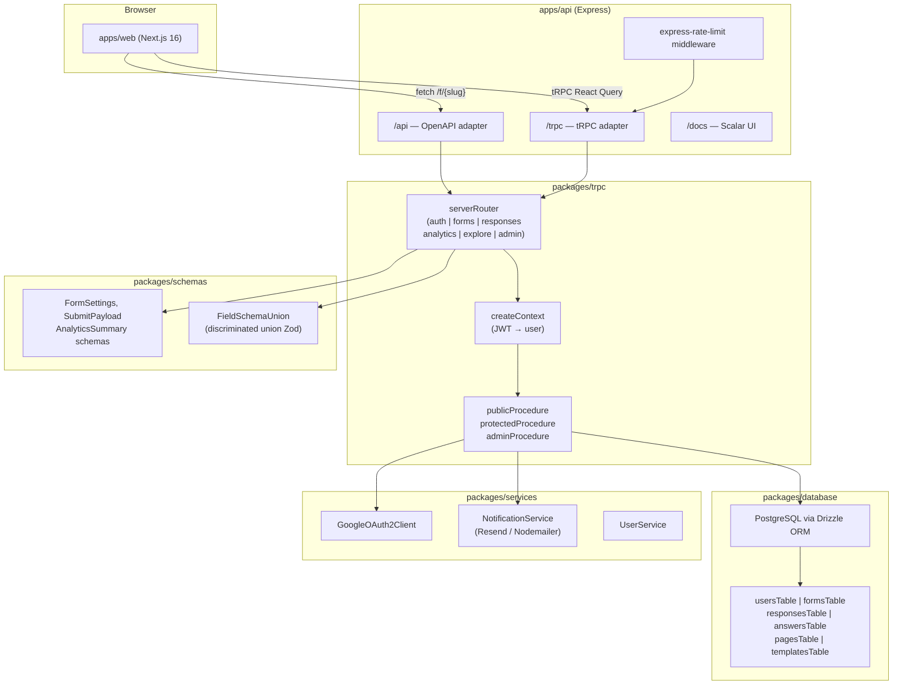
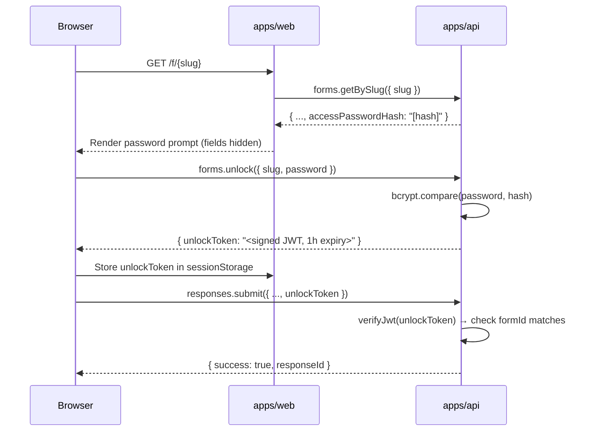

# Design Document: ChaiForms — Form Builder SaaS

## Overview

ChaiForms is a Typeform-style form builder SaaS layered on top of the existing Turborepo monorepo. Authenticated creators build, publish, and analyze forms; unauthenticated respondents fill and submit them via shareable links. The system reuses the existing Express + tRPC v11 backend, Next.js 16 frontend, Drizzle ORM + PostgreSQL data layer, and Google OAuth infrastructure, extending each with new tables, procedures, and UI surfaces.

### Key Design Goals

- **Type safety end-to-end**: shared Zod schemas in `packages/schemas` flow from DB → tRPC → React without duplication.
- **Schema-less field evolution**: form fields stored as JSONB on `formsTable`; answers normalized to `answersTable` rows for analytics.
- **Zero-auth public submission**: respondents never need an account; rate limiting protects the submit endpoint.
- **Discriminated-union field schemas**: `FieldSchemaUnion` ensures compile-time exhaustiveness and runtime validation.
- **Fire-and-forget email**: notifications never block the response persist path.

---

## Architecture

### Component Diagram



### Request Flow — Protected Procedure

```
Browser → POST /trpc/forms.create
  → (no rate limit on creator procedures)
  → tRPC adapter → createContext()
      → reads "session" HTTP-only cookie
      → verifies JWT (jsonwebtoken)
      → queries usersTable by id
      → attaches { user } to ctx
  → protectedProcedure middleware
      → throws UNAUTHORIZED if ctx.user is null
  → forms.create handler
      → validates input with Zod
      → inserts formsTable row
      → returns form
```

### Request Flow — Public Form Submit

```
Browser → POST /trpc/responses.submit
  → assertSubmitRateLimit (10 req / 60s per IP, in procedure)
      → TOO_MANY_REQUESTS if exceeded
  → tRPC adapter → createContext() (no auth required)
  → publicProcedure
  → responses.submit handler
      → load form + fields from formsTable
      → check status, expiry, responseLimit, password token
      → validate answers against FieldSchemaUnion
      → insert responsesTable row (startedAt from payload, submittedAt = now)
      → bulk insert answersTable rows
      → fire-and-forget: NotificationService.sendSubmissionEmails()
      → return { success: true, responseId }
```


---

## Components and Interfaces

### New Package: `packages/schemas`

This package is the single source of truth for all shared Zod schemas. Both `apps/api` (via `packages/trpc`) and `apps/web` import from here.

**Package structure:**
```
packages/schemas/
  src/
    fields/
      short-text.ts
      long-text.ts
      email.ts
      number.ts
      single-select.ts
      multi-select.ts
      checkbox.ts
      rating.ts
      date.ts
      index.ts          ← exports FieldSchemaUnion
    form-settings.ts
    response.ts
    analytics.ts
    index.ts
  package.json
  tsconfig.json
```

**`package.json` name:** `@repo/schemas`

### `packages/trpc` Extensions

New files added to `packages/trpc/server/routes/`:
```
routes/
  auth/route.ts          (existing — extended with callback, signOut)
  forms/route.ts         (new)
  responses/route.ts     (new)
  analytics/route.ts     (new)
  explore/route.ts       (new)
  admin/route.ts         (new)
```

Updated `packages/trpc/server/trpc.ts` exports:
- `publicProcedure` (existing)
- `protectedProcedure` (new — JWT middleware)
- `adminProcedure` (new — JWT + role=admin middleware)
- `router` (existing)

Updated `packages/trpc/server/context.ts`:
```typescript
import { CreateExpressContextOptions } from "@trpc/server/adapters/express";
import { verifyJwt } from "./utils/jwt";
import { db } from "@repo/database";
import { usersTable } from "@repo/database/schema";
import { eq } from "drizzle-orm";

export async function createContext({ req, res }: CreateExpressContextOptions) {
  const token = req.cookies?.session ?? null;
  let user: SelectUser | null = null;
  if (token) {
    try {
      const payload = verifyJwt(token);
      const [found] = await db.select().from(usersTable).where(eq(usersTable.id, payload.sub));
      user = found ?? null;
    } catch {
      // invalid/expired token — treat as unauthenticated
    }
  }
  return { user, req, res };
}

export type Context = Awaited<ReturnType<typeof createContext>>;
```

### Auth Middleware

```typescript
// packages/trpc/server/trpc.ts (additions)
import { TRPCError } from "@trpc/server";

export const protectedProcedure = tRPCContext.procedure.use(({ ctx, next }) => {
  if (!ctx.user) throw new TRPCError({ code: "UNAUTHORIZED" });
  return next({ ctx: { ...ctx, user: ctx.user } });
});

export const adminProcedure = protectedProcedure.use(({ ctx, next }) => {
  if (ctx.user.role !== "admin") throw new TRPCError({ code: "FORBIDDEN" });
  return next({ ctx });
});
```

### JWT Utility

```typescript
// packages/trpc/server/utils/jwt.ts
import jwt from "jsonwebtoken";

const SECRET = process.env.JWT_SECRET!;
const EXPIRY = "7d";

export function signJwt(userId: string): string {
  return jwt.sign({ sub: userId }, SECRET, { expiresIn: EXPIRY });
}

export function verifyJwt(token: string): { sub: string } {
  return jwt.verify(token, SECRET) as { sub: string };
}
```

Cookie strategy: `httpOnly: true`, `sameSite: "lax"`, `secure: true` in production, `maxAge: 7 * 24 * 60 * 60 * 1000` (7 days).

### Express middleware prerequisites

```typescript
// apps/api/src/server.ts (additions)
import cookieParser from "cookie-parser";

app.use(cookieParser());
// CORS: use explicit origin + credentials when web and API are on different hosts
app.use(cors({
  origin: env.WEB_ORIGIN,       // e.g. https://chaiforms.vercel.app
  credentials: true,
}));
```

The ChaiForms_Web tRPC client must set `fetch` / HTTP link `credentials: "include"` so the `session` cookie is sent on protected procedures.


---

## Data Models

### Drizzle Schema — `packages/database/models/`

#### Extended `usersTable` (`models/user.ts`)

```typescript
import { pgTable, uuid, varchar, timestamp, boolean, text, pgEnum } from "drizzle-orm/pg-core";

export const userRoleEnum = pgEnum("user_role", ["creator", "admin"]);

export const usersTable = pgTable("users", {
  id: uuid("id").primaryKey().defaultRandom(),
  fullName: varchar("full_name", { length: 80 }).notNull(),
  email: varchar("email", { length: 255 }).notNull().unique(),
  emailVerified: boolean("email_verified").default(false),
  profileImageUrl: text("profile_image_url"),
  role: userRoleEnum("role").default("creator").notNull(),
  createdAt: timestamp("created_at").defaultNow(),
  updatedAt: timestamp("updated_at").$onUpdate(() => new Date()),
});
```

#### `formsTable` (`models/form.ts`)

```typescript
import { pgTable, uuid, varchar, text, timestamp, jsonb, integer, pgEnum, boolean, index, uniqueIndex } from "drizzle-orm/pg-core";
import { usersTable } from "./user";
import type { FieldSchemaUnion } from "@repo/schemas";

export const formStatusEnum = pgEnum("form_status", ["draft", "published", "archived"]);
export const formVisibilityEnum = pgEnum("form_visibility", ["public", "unlisted"]);
export const formThemeEnum = pgEnum("form_theme", [
  "default", "anime", "movie", "game", "startup", "tech_company", "os", "event"
]);

export const formsTable = pgTable("forms", {
  id: uuid("id").primaryKey().defaultRandom(),
  creatorId: uuid("creator_id").notNull().references(() => usersTable.id, { onDelete: "cascade" }),
  title: varchar("title", { length: 255 }).notNull(),
  description: text("description"),
  slug: varchar("slug", { length: 60 }).notNull(),
  status: formStatusEnum("status").default("draft").notNull(),
  visibility: formVisibilityEnum("visibility").default("unlisted").notNull(),
  theme: formThemeEnum("theme").default("default").notNull(),
  fields: jsonb("fields").$type<FieldSchemaUnion[]>().default([]).notNull(),
  thankyouMessage: text("thankyou_message"),
  expiryDate: timestamp("expiry_date"),
  responseLimit: integer("response_limit"),
  accessPasswordHash: text("access_password_hash"),
  sendRespondentConfirmation: boolean("send_respondent_confirmation").default(false).notNull(),
  createdAt: timestamp("created_at").defaultNow(),
  updatedAt: timestamp("updated_at").$onUpdate(() => new Date()),
}, (t) => [
  uniqueIndex("forms_slug_unique").on(t.slug),
  index("forms_creator_id_idx").on(t.creatorId),
  index("forms_status_visibility_idx").on(t.status, t.visibility),
]);

export type SelectForm = typeof formsTable.$inferSelect;
export type InsertForm = typeof formsTable.$inferInsert;
```

#### `pagesTable` (`models/page.ts`)

```typescript
import { pgTable, uuid, varchar, integer, index } from "drizzle-orm/pg-core";
import { formsTable } from "./form";

export const pagesTable = pgTable("pages", {
  id: uuid("id").primaryKey().defaultRandom(),
  formId: uuid("form_id").notNull().references(() => formsTable.id, { onDelete: "cascade" }),
  title: varchar("title", { length: 255 }).notNull(),
  order: integer("order").notNull(),
  fieldIds: uuid("field_ids").array().notNull().default([]),
}, (t) => [
  index("pages_form_id_idx").on(t.formId),
]);

export type SelectPage = typeof pagesTable.$inferSelect;
export type InsertPage = typeof pagesTable.$inferInsert;
```

#### `responsesTable` (`models/response.ts`)

```typescript
import { pgTable, uuid, timestamp, text, index } from "drizzle-orm/pg-core";
import { formsTable } from "./form";

export const responsesTable = pgTable("responses", {
  id: uuid("id").primaryKey().defaultRandom(),
  formId: uuid("form_id").notNull().references(() => formsTable.id, { onDelete: "cascade" }),
  startedAt: timestamp("started_at").notNull(),
  submittedAt: timestamp("submitted_at").notNull().defaultNow(),
  respondentEmail: text("respondent_email"),
  unlockToken: text("unlock_token"),
}, (t) => [
  index("responses_form_id_idx").on(t.formId),
  index("responses_created_at_idx").on(t.submittedAt),
]);

export type SelectResponse = typeof responsesTable.$inferSelect;
export type InsertResponse = typeof responsesTable.$inferInsert;
```

#### `answersTable` (`models/answer.ts`)

```typescript
import { pgTable, uuid, text, index } from "drizzle-orm/pg-core";
import { responsesTable } from "./response";

export const answersTable = pgTable("answers", {
  id: uuid("id").primaryKey().defaultRandom(),
  responseId: uuid("response_id").notNull().references(() => responsesTable.id, { onDelete: "cascade" }),
  fieldId: uuid("field_id").notNull(),
  value: text("value").notNull(),
}, (t) => [
  index("answers_response_id_idx").on(t.responseId),
  index("answers_field_id_idx").on(t.fieldId),
]);

export type SelectAnswer = typeof answersTable.$inferSelect;
export type InsertAnswer = typeof answersTable.$inferInsert;
```

#### `templatesTable` (`models/template.ts`)

```typescript
import { pgTable, uuid, varchar, text, jsonb } from "drizzle-orm/pg-core";
import { formThemeEnum } from "./form";
import type { FieldSchemaUnion } from "@repo/schemas";

export const templatesTable = pgTable("templates", {
  id: uuid("id").primaryKey().defaultRandom(),
  title: varchar("title", { length: 255 }).notNull(),
  description: text("description"),
  theme: formThemeEnum("theme").default("default").notNull(),
  fields: jsonb("fields").$type<FieldSchemaUnion[]>().default([]).notNull(),
  createdAt: timestamp("created_at").defaultNow(),
});

export type SelectTemplate = typeof templatesTable.$inferSelect;
export type InsertTemplate = typeof templatesTable.$inferInsert;
```

#### Updated `packages/database/schema.ts`

```typescript
export * from "./models/user";
export * from "./models/form";
export * from "./models/page";
export * from "./models/response";
export * from "./models/answer";
export * from "./models/template";
```


### `packages/schemas` — FieldSchemaUnion

The discriminated union uses `type` as the discriminant. Each variant carries only the properties valid for that type.

```typescript
// packages/schemas/src/fields/index.ts
import { z } from "zod";

const baseField = z.object({
  id: z.string().uuid(),
  label: z.string().min(1),
  required: z.boolean().default(false),
  placeholder: z.string().optional(),
  description: z.string().optional(),
  conditionalRules: z.array(z.object({
    sourceFieldId: z.string().uuid(),
    operator: z.enum(["equals", "not_equals", "contains", "is_empty", "is_not_empty"]),
    value: z.string().optional(),
  })).optional(),
});

export const shortTextFieldSchema = baseField.extend({
  type: z.literal("short_text"),
  minLength: z.number().int().min(0).optional(),
  maxLength: z.number().int().min(1).optional(),
  validationRegex: z.string().optional(),
});

export const longTextFieldSchema = baseField.extend({
  type: z.literal("long_text"),
  minLength: z.number().int().min(0).optional(),
  maxLength: z.number().int().min(1).optional(),
});

export const emailFieldSchema = baseField.extend({
  type: z.literal("email"),
});

export const numberFieldSchema = baseField.extend({
  type: z.literal("number"),
  min: z.number().int().optional(),
  max: z.number().int().optional(),
});

export const singleSelectFieldSchema = baseField.extend({
  type: z.literal("single_select"),
  options: z.array(z.string().min(1)).min(2),
});

export const multiSelectFieldSchema = baseField.extend({
  type: z.literal("multi_select"),
  options: z.array(z.string().min(1)).min(2),
});

export const checkboxFieldSchema = baseField.extend({
  type: z.literal("checkbox"),
});

export const ratingFieldSchema = baseField.extend({
  type: z.literal("rating"),
  maxRating: z.number().int().min(2).max(10),
});

export const dateFieldSchema = baseField.extend({
  type: z.literal("date"),
  minDate: z.string().datetime().optional(),
  maxDate: z.string().datetime().optional(),
});

export const FieldSchemaUnion = z.discriminatedUnion("type", [
  shortTextFieldSchema,
  longTextFieldSchema,
  emailFieldSchema,
  numberFieldSchema,
  singleSelectFieldSchema,
  multiSelectFieldSchema,
  checkboxFieldSchema,
  ratingFieldSchema,
  dateFieldSchema,
]);

export type FieldSchemaUnion = z.infer<typeof FieldSchemaUnion>;
export type FieldType = FieldSchemaUnion["type"];
```

```typescript
// packages/schemas/src/form-settings.ts
import { z } from "zod";
import { FieldSchemaUnion } from "./fields";

export const slugPattern = /^[a-z0-9-]{3,60}$/;

export const pageSchema = z.object({
  id: z.string().uuid(),
  title: z.string().min(1),
  order: z.number().int().min(0),
  fieldIds: z.array(z.string().uuid()),
});

export const formSettingsSchema = z.object({
  title: z.string().min(1).max(255).optional(),
  description: z.string().max(2000).optional(),
  slug: z.string().regex(slugPattern).optional(),
  status: z.enum(["draft", "published", "archived"]).optional(),
  visibility: z.enum(["public", "unlisted"]).optional(),
  theme: z.enum(["default", "anime", "movie", "game", "startup", "tech_company", "os", "event"]).optional(),
  thankyouMessage: z.string().max(1000).optional(),
  expiryDate: z.string().datetime().nullable().optional(),
  responseLimit: z.number().int().min(1).nullable().optional(),
  accessPassword: z.string().min(4).nullable().optional(),
  sendRespondentConfirmation: z.boolean().optional(),
  pages: z.array(pageSchema).optional(),
});

export const fieldsUpsertSchema = z.object({
  formId: z.string().uuid(),
  fields: z.array(FieldSchemaUnion),
  pages: z.array(pageSchema).optional(),
});
```

```typescript
// packages/schemas/src/response.ts
import { z } from "zod";

export const answerSchema = z.object({
  fieldId: z.string().uuid(),
  // All answers stored as text; multi_select uses JSON.stringify(string[])
  value: z.string(),
});

export const submitResponseSchema = z.object({
  formId: z.string().uuid(),
  startedAt: z.string().datetime(),
  answers: z.array(answerSchema),
  unlockToken: z.string().optional(),
});
```

```typescript
// packages/schemas/src/analytics.ts
import { z } from "zod";

export const analyticsSummarySchema = z.object({
  totalResponses: z.number().int(),
  completionRate: z.number().min(0).max(100),
  avgDurationSeconds: z.number().nullable(),
});

export const fieldBreakdownItemSchema = z.object({
  fieldId: z.string().uuid(),
  fieldLabel: z.string(),
  responseCount: z.number().int(),
  distribution: z.record(z.string(), z.number().int()),
});
```


---

## tRPC Procedure Signatures

All procedures include `.meta({ openapi: { ... } })` for Scalar docs. Paths follow the existing `generatePath` utility pattern.

### `auth` Router (extended)

```typescript
// packages/trpc/server/routes/auth/route.ts
const TAGS = ["Authentication"];

authRouter = router({
  // existing
  getSupportedAuthenticationProviders: publicProcedure
    .meta({ openapi: { method: "GET", path: "/authentication/supported-providers", tags: TAGS } })
    .input(z.undefined())
    .output(z.array(getAuthenticationMethodOutputSchema))
    .query(...),

  // new
  callback: publicProcedure
    .meta({ openapi: { method: "GET", path: "/authentication/callback", tags: TAGS } })
    .input(z.object({ code: z.string() }))
    .output(z.object({ user: userOutputSchema }))
    .query(async ({ input, ctx }) => {
      // exchange code → Google ID token → upsert user → sign JWT → set cookie
    }),

  signOut: protectedProcedure
    .meta({ openapi: { method: "POST", path: "/authentication/sign-out", tags: TAGS } })
    .input(z.undefined())
    .output(z.object({ success: z.boolean() }))
    .mutation(async ({ ctx }) => {
      // clear session cookie
    }),

  me: protectedProcedure
    .meta({ openapi: { method: "GET", path: "/authentication/me", tags: TAGS } })
    .input(z.undefined())
    .output(userOutputSchema)
    .query(async ({ ctx }) => ctx.user),

  // P0 judge path — only when ENABLE_DEMO_LOGIN=true (see Requirement 17.5)
  demoLogin: publicProcedure
    .meta({ openapi: { method: "POST", path: "/authentication/demo-login", tags: TAGS } })
    .input(z.object({ email: z.enum(["demo@chaiforms.dev", "admin@chaiforms.dev"]) }))
    .output(z.object({ user: userOutputSchema }))
    .mutation(async ({ input, ctx }) => {
      if (process.env.ENABLE_DEMO_LOGIN !== "true") {
        throw new TRPCError({ code: "NOT_FOUND" });
      }
      // load seeded user by email → signJwt → set session cookie
    }),
});
```

### `forms` Router

```typescript
// packages/trpc/server/routes/forms/route.ts
const TAGS = ["Forms"];

formsRouter = router({
  create: protectedProcedure
    .meta({ openapi: { method: "POST", path: "/forms", tags: TAGS } })
    .input(z.object({ title: z.string().min(1).max(255) }))
    .output(formOutputSchema)
    .mutation(...),

  list: protectedProcedure
    .meta({ openapi: { method: "GET", path: "/forms", tags: TAGS } })
    .input(z.object({ page: z.number().int().min(1).default(1), pageSize: z.number().int().min(1).max(100).default(20) }))
    .output(paginatedFormsSchema)
    .query(...),

  getById: protectedProcedure
    .meta({ openapi: { method: "GET", path: "/forms/{formId}", tags: TAGS } })
    .input(z.object({ formId: z.string().uuid() }))
    .output(formOutputSchema)
    .query(...),

  getBySlug: publicProcedure
    .meta({ openapi: { method: "GET", path: "/forms/slug/{slug}", tags: ["Forms", "Sharing"] } })
    .input(z.object({ slug: z.string() }))
    .output(publicFormOutputSchema)
    .query(...),

  update: protectedProcedure
    .meta({ openapi: { method: "PATCH", path: "/forms/{formId}", tags: TAGS } })
    .input(z.object({ formId: z.string().uuid() }).merge(formSettingsSchema))
    .output(formOutputSchema)
    .mutation(...),

  publish: protectedProcedure
    .meta({ openapi: { method: "POST", path: "/forms/{formId}/publish", tags: TAGS } })
    .input(z.object({ formId: z.string().uuid() }))
    .output(formOutputSchema)
    .mutation(...),

  unpublish: protectedProcedure
    .meta({ openapi: { method: "POST", path: "/forms/{formId}/unpublish", tags: TAGS } })
    .input(z.object({ formId: z.string().uuid() }))
    .output(formOutputSchema)
    .mutation(...),

  delete: protectedProcedure
    .meta({ openapi: { method: "DELETE", path: "/forms/{formId}", tags: TAGS } })
    .input(z.object({ formId: z.string().uuid() }))
    .output(z.object({ success: z.boolean() }))
    .mutation(...),

  clone: protectedProcedure
    .meta({ openapi: { method: "POST", path: "/forms/{formId}/clone", tags: TAGS } })
    .input(z.object({ formId: z.string().uuid() }))
    .output(formOutputSchema)
    .mutation(...),

  fieldsUpsert: protectedProcedure
    .meta({ openapi: { method: "PUT", path: "/forms/{formId}/fields", tags: ["Forms", "Fields"] } })
    .input(fieldsUpsertSchema)
    .output(formOutputSchema)
    .mutation(...),

  unlock: publicProcedure
    .meta({ openapi: { method: "POST", path: "/forms/{slug}/unlock", tags: ["Forms", "Sharing"] } })
    .input(z.object({ slug: z.string(), password: z.string() }))
    .output(z.object({ unlockToken: z.string() }))
    .mutation(...),

  createFromTemplate: protectedProcedure
    .meta({ openapi: { method: "POST", path: "/forms/from-template/{templateId}", tags: ["Forms", "Templates"] } })
    .input(z.object({ templateId: z.string().uuid() }))
    .output(formOutputSchema)
    .mutation(...),
});
```

### `responses` Router

```typescript
// packages/trpc/server/routes/responses/route.ts
const TAGS = ["Responses"];

responsesRouter = router({
  submit: publicProcedure
    .meta({ openapi: { method: "POST", path: "/responses/submit", tags: TAGS } })
    .input(submitResponseSchema)
    .output(z.object({ success: z.boolean(), responseId: z.string().uuid() }))
    .mutation(...),

  list: protectedProcedure
    .meta({ openapi: { method: "GET", path: "/responses", tags: TAGS } })
    .input(z.object({
      formId: z.string().uuid(),
      page: z.number().int().min(1).default(1),
      pageSize: z.number().int().min(1).max(100).default(20),
      startDate: z.string().datetime().optional(),
      endDate: z.string().datetime().optional(),
    }))
    .output(paginatedResponsesSchema)
    .query(...),

  exportCsv: protectedProcedure
    .meta({ openapi: { method: "GET", path: "/responses/export-csv", tags: TAGS } })
    .input(z.object({ formId: z.string().uuid() }))
    .output(z.string().describe("CSV content"))
    .query(...),
});
```

### `analytics` Router

```typescript
// packages/trpc/server/routes/analytics/route.ts
const TAGS = ["Analytics"];

analyticsRouter = router({
  getSummary: protectedProcedure
    .meta({ openapi: { method: "GET", path: "/analytics/summary", tags: TAGS } })
    .input(z.object({ formId: z.string().uuid() }))
    .output(analyticsSummarySchema)
    .query(...),

  getFieldBreakdown: protectedProcedure
    .meta({ openapi: { method: "GET", path: "/analytics/field-breakdown", tags: TAGS } })
    .input(z.object({ formId: z.string().uuid() }))
    .output(z.array(fieldBreakdownItemSchema))
    .query(...),

  getResponsesOverTime: protectedProcedure
    .meta({ openapi: { method: "GET", path: "/analytics/responses-over-time", tags: TAGS } })
    .input(z.object({ formId: z.string().uuid(), granularity: z.enum(["day", "week", "month"]).default("day") }))
    .output(z.array(z.object({ date: z.string(), count: z.number().int() })))
    .query(...),
});
```

### `explore` Router

```typescript
// packages/trpc/server/routes/explore/route.ts
const TAGS = ["Explore"];

exploreRouter = router({
  listPublicForms: publicProcedure
    .meta({ openapi: { method: "GET", path: "/explore/forms", tags: TAGS } })
    .input(z.object({ page: z.number().int().min(1).default(1), pageSize: z.number().int().min(1).max(50).default(12) }))
    .output(paginatedPublicFormsSchema)
    .query(...),

  listFeaturedForms: publicProcedure
    .meta({ openapi: { method: "GET", path: "/explore/featured", tags: TAGS } })
    .input(z.undefined())
    .output(z.array(publicFormCardSchema))
    .query(...),

  listTemplates: publicProcedure
    .meta({ openapi: { method: "GET", path: "/explore/templates", tags: ["Explore", "Templates"] } })
    .input(z.undefined())
    .output(z.array(templateOutputSchema))
    .query(...),
});
```

### `admin` Router

```typescript
// packages/trpc/server/routes/admin/route.ts
const TAGS = ["Admin"];

adminRouter = router({
  getStats: adminProcedure
    .meta({ openapi: { method: "GET", path: "/admin/stats", tags: TAGS } })
    .input(z.undefined())
    .output(platformStatsSchema)
    .query(...),

  listForms: adminProcedure
    .meta({ openapi: { method: "GET", path: "/admin/forms", tags: TAGS } })
    .input(z.object({ page: z.number().int().min(1).default(1), pageSize: z.number().int().min(1).max(100).default(20) }))
    .output(paginatedAdminFormsSchema)
    .query(...),

  listUsers: adminProcedure
    .meta({ openapi: { method: "GET", path: "/admin/users", tags: TAGS } })
    .input(z.object({ page: z.number().int().min(1).default(1), pageSize: z.number().int().min(1).max(100).default(20) }))
    .output(paginatedAdminUsersSchema)
    .query(...),
});
```

### Updated `serverRouter`

```typescript
// packages/trpc/server/index.ts
export const serverRouter = router({
  health: healthRouter,
  auth: authRouter,
  forms: formsRouter,
  responses: responsesRouter,
  analytics: analyticsRouter,
  explore: exploreRouter,
  admin: adminRouter,
});
```


---

## Auth Flow

### Google OAuth Callback Sequence

```mermaid
sequenceDiagram
    participant Browser
    participant Web as apps/web
    participant API as apps/api
    participant Google

    Browser->>Web: GET /login
    Web->>API: trpc.auth.getSupportedAuthenticationProviders()
    API-->>Web: [{ provider: "GOOGLE_OAUTH", authUrl }]
    Web-->>Browser: Render "Sign in with Google" button → authUrl

    Browser->>Google: GET authUrl (redirect)
    Google-->>Browser: Redirect to /auth/callback?code=...

    Browser->>API: GET /api/authentication/callback?code=...
    API->>Google: exchange code → ID token
    Google-->>API: { email, name, picture, sub }
    API->>DB: upsert usersTable (email unique key)
    DB-->>API: user record
    API->>API: signJwt(user.id)
    API-->>Browser: Set-Cookie: session=<jwt>; HttpOnly; SameSite=Lax
    API-->>Browser: 200 { user }
    Browser->>Web: redirect to /dashboard
```

### JWT Strategy

- **Algorithm**: HS256 with `JWT_SECRET` env var (min 32 chars)
- **Payload**: `{ sub: userId, iat, exp }`
- **Expiry**: 7 days
- **Cookie**: `session`, `httpOnly`, `sameSite: lax`, `secure` in production
- **Rotation**: not implemented (stateless); sign-out clears cookie client-side
- **Verification**: `jsonwebtoken.verify()` in `createContext` on every request

### `protectedProcedure` Middleware

The middleware runs after `createContext`. If `ctx.user` is null (no cookie, invalid JWT, or user not found in DB), it throws `TRPCError({ code: "UNAUTHORIZED" })`. This is the single enforcement point — no per-route auth checks needed.

### `adminProcedure` Middleware

Chains after `protectedProcedure`. Checks `ctx.user.role === "admin"`, throws `TRPCError({ code: "FORBIDDEN" })` otherwise.

---

## Rate Limiting Strategy

Rate limiting is enforced **inside** `responses.submit` (and the OpenAPI equivalent), not via Express path matching on `/trpc` (tRPC uses `POST /trpc` with a batch/procedure body, so path-based middleware does not reliably target a single procedure).

```typescript
// packages/trpc/server/utils/submit-rate-limit.ts
import rateLimit from "express-rate-limit";

// In-memory store keyed by IP — swap to rate-limit-redis for multi-instance prod
const submitCounts = new Map<string, { count: number; resetAt: number }>();

export function assertSubmitRateLimit(ip: string): void {
  const windowMs = 60_000;
  const max = 10;
  const now = Date.now();
  const entry = submitCounts.get(ip) ?? { count: 0, resetAt: now + windowMs };
  if (now > entry.resetAt) {
    entry.count = 0;
    entry.resetAt = now + windowMs;
  }
  entry.count += 1;
  submitCounts.set(ip, entry);
  if (entry.count > max) {
    throw new TRPCError({
      code: "TOO_MANY_REQUESTS",
      message: "Too many submissions. Please wait before trying again.",
    });
  }
}

// responses.submit handler (first line):
assertSubmitRateLimit(ctx.req.ip ?? "unknown");
```

For OpenAPI `POST /api/responses/submit`, apply the same helper or a thin Express middleware only on that exact REST path (supported by `trpc-to-openapi`).

**Rationale**: Procedure-level limiting works for both `/trpc` and `/api` adapters. The 10/60s limit is generous enough for legitimate use but blocks automated spam.

---

## Email Notification Architecture

### Provider Choice: Resend

Resend is chosen over Nodemailer because:
- Single SDK, no SMTP configuration
- Reliable deliverability with minimal setup
- Free tier covers hackathon volume
- TypeScript-first API

### `packages/services/notification/index.ts`

```typescript
import { Resend } from "resend";
import { logger } from "@repo/logger";

const resend = new Resend(process.env.RESEND_API_KEY);

export class NotificationService {
  async sendSubmissionEmails(opts: {
    creatorEmail: string;
    formTitle: string;
    formId: string;
    responseId: string;
    respondentEmail?: string;
    sendRespondentConfirmation: boolean;
    webBaseUrl: string;
  }): Promise<void> {
    // Fire-and-forget: errors are logged, never thrown
    const tasks: Promise<unknown>[] = [];

    tasks.push(
      resend.emails.send({
        from: "ChaiForms <notifications@chaiforms.dev>",
        to: opts.creatorEmail,
        subject: `New response: ${opts.formTitle}`,
        html: creatorEmailHtml(opts),
      }).catch((err) => {
        logger.error("Creator email failed", { formId: opts.formId, responseId: opts.responseId, error: err.message });
      })
    );

    if (opts.sendRespondentConfirmation && opts.respondentEmail) {
      tasks.push(
        resend.emails.send({
          from: "ChaiForms <notifications@chaiforms.dev>",
          to: opts.respondentEmail,
          subject: `Thanks for filling out: ${opts.formTitle}`,
          html: respondentEmailHtml(opts),
        }).catch((err) => {
          logger.error("Respondent email failed", { formId: opts.formId, responseId: opts.responseId, error: err.message });
        })
      );
    }

    // Do not await — fire and forget
    void Promise.allSettled(tasks);
  }
}
```

The `responses.submit` handler calls `notificationService.sendSubmissionEmails(...)` without `await`. The response is returned to the client immediately after DB writes complete.


---

## Frontend Route Structure

All routes use Next.js App Router (`app/` directory). Auth guard is implemented via a `middleware.ts` at the `apps/web` root.

```
app/
  layout.tsx                          ← GlobalProviders, font, metadata
  page.tsx                            ← / (landing page)
  globals.css                         ← Tailwind + theme CSS variables

  (marketing)/
    pricing/page.tsx                  ← /pricing
    explore/page.tsx                  ← /explore
    templates/page.tsx                ← /templates

  auth/
    callback/page.tsx                 ← /auth/callback (handles OAuth redirect)

  login/page.tsx                      ← /login

  f/
    [slug]/
      page.tsx                        ← /f/{slug} (public form submission)
      password/page.tsx               ← /f/{slug}/password (unlock prompt)

  dashboard/
    layout.tsx                        ← auth guard + dashboard shell
    page.tsx                          ← /dashboard (summary)
    forms/
      page.tsx                        ← /dashboard/forms (list)
      new/page.tsx                    ← /dashboard/forms/new (create)
      [formId]/
        edit/page.tsx                 ← /dashboard/forms/{formId}/edit (builder)
        analytics/page.tsx            ← /dashboard/forms/{formId}/analytics
        preview/page.tsx              ← /dashboard/forms/{formId}/preview
        responses/page.tsx            ← /dashboard/forms/{formId}/responses

  admin/
    layout.tsx                        ← admin role guard
    page.tsx                          ← /admin (stats + tables)
    forms/page.tsx                    ← /admin/forms
    users/page.tsx                    ← /admin/users

middleware.ts                         ← redirects /dashboard/* → /login if no session cookie
                                         redirects /admin/* → /dashboard if not admin
```

### Auth Middleware (`apps/web/middleware.ts`)

```typescript
import { NextResponse } from "next/server";
import type { NextRequest } from "next/server";
import { jwtVerify } from "jose";

export async function middleware(request: NextRequest) {
  const { pathname } = request.nextUrl;
  const token = request.cookies.get("session")?.value;

  const isAuthenticated = token ? await verifyToken(token) : false;

  if (pathname.startsWith("/dashboard") && !isAuthenticated) {
    return NextResponse.redirect(new URL("/login", request.url));
  }
  if (pathname === "/login" && isAuthenticated) {
    return NextResponse.redirect(new URL("/dashboard", request.url));
  }
  return NextResponse.next();
}

export const config = {
  matcher: ["/dashboard/:path*", "/admin/:path*", "/login"],
};
```

Note: Admin role check for `/admin/*` is done server-side in the admin layout component via `trpc.admin.getStats` — if it throws FORBIDDEN, redirect to `/dashboard`.

---

## Form Builder UI Architecture

### Three-Panel Layout

```
┌─────────────────────────────────────────────────────────────────┐
│  Header: Form title (editable) │ Saving… / Saved │ Preview │ Publish │
├──────────────┬──────────────────────────────┬───────────────────┤
│  Left Panel  │      Center Canvas           │   Right Panel     │
│  (240px)     │      (flex-1)                │   (320px)         │
│              │                              │                   │
│  Field Types │  ┌──────────────────────┐   │  Field Config     │
│  ─────────── │  │  [Page 1]            │   │  ─────────────    │
│  Short Text  │  │  ┌────────────────┐  │   │  Label            │
│  Long Text   │  │  │ Field Card 1   │  │   │  Required toggle  │
│  Email       │  │  └────────────────┘  │   │  Placeholder      │
│  Number      │  │  ┌────────────────┐  │   │  Description      │
│  Single Sel  │  │  │ Field Card 2   │  │   │  Type-specific    │
│  Multi Sel   │  │  └────────────────┘  │   │  options          │
│  Checkbox    │  │  + Add Field         │   │  Conditional      │
│  Rating      │  └──────────────────────┘   │  Rules            │
│  Date        │                              │                   │
│              │  + Add Page                  │                   │
└──────────────┴──────────────────────────────┴───────────────────┘
```

Implemented with `react-resizable-panels`:
```tsx
<PanelGroup direction="horizontal">
  <Panel defaultSize={18} minSize={15} maxSize={25}>
    <FieldTypePalette />
  </Panel>
  <PanelResizeHandle />
  <Panel defaultSize={57} minSize={40}>
    <FormCanvas />
  </Panel>
  <PanelResizeHandle />
  <Panel defaultSize={25} minSize={20} maxSize={35}>
    <FieldConfigPanel />
  </Panel>
</PanelGroup>
```

### Drag-and-Drop with `@dnd-kit/core`

```typescript
// apps/web/components/form-builder/form-canvas.tsx
import { DndContext, closestCenter, DragEndEvent } from "@dnd-kit/core";
import { SortableContext, verticalListSortingStrategy, arrayMove } from "@dnd-kit/sortable";

// Field cards use useSortable() hook
// On DragEnd: reorder fields array → trigger debounced save
```

**Drag sources:**
1. Field type palette → canvas: adds new field at drop position
2. Field card handle → reorder within canvas

**Drop targets:**
- Canvas accepts field type drags (adds new field)
- Field cards accept reorder drags (sortable)

### Auto-Save with Debounce

```typescript
// apps/web/hooks/use-form-autosave.ts
import { useDebouncedCallback } from "use-debounce";
import { trpc } from "~/trpc/client";

export function useFormAutosave(formId: string) {
  const utils = trpc.useUtils();
  const mutation = trpc.forms.fieldsUpsert.useMutation();
  const [saveState, setSaveState] = useState<"idle" | "saving" | "saved">("idle");

  const debouncedSave = useDebouncedCallback(async (fields: FieldSchemaUnion[]) => {
    setSaveState("saving");
    await mutation.mutateAsync({ formId, fields });
    setSaveState("saved");
    setTimeout(() => setSaveState("idle"), 2000);
  }, 1000); // 1 second debounce

  return { debouncedSave, saveState };
}
```

### Conditional Logic Engine

```typescript
// apps/web/lib/conditional-logic.ts
import type { FieldSchemaUnion } from "@repo/schemas";

export type AnswerMap = Record<string, string>;

export function evaluateConditionalRules(
  field: FieldSchemaUnion,
  answers: AnswerMap
): boolean {
  if (!field.conditionalRules || field.conditionalRules.length === 0) return true;

  return field.conditionalRules.every((rule) => {
    const sourceValue = answers[rule.sourceFieldId] ?? "";
    switch (rule.operator) {
      case "equals": return sourceValue === rule.value;
      case "not_equals": return sourceValue !== rule.value;
      case "contains": return sourceValue.includes(rule.value ?? "");
      case "is_empty": return sourceValue.trim() === "";
      case "is_not_empty": return sourceValue.trim() !== "";
      default: return true;
    }
  });
}

export function getVisibleFields(
  fields: FieldSchemaUnion[],
  answers: AnswerMap
): FieldSchemaUnion[] {
  return fields.filter((f) => evaluateConditionalRules(f, answers));
}
```


---

## Theme System

Themes are implemented as CSS custom property sets applied to the form submission page and editor preview. Each theme overrides a fixed set of variables defined in `apps/web/app/globals.css`.

### CSS Variable Contract

```css
/* apps/web/app/globals.css — base contract */
:root {
  --form-bg: hsl(0 0% 100%);
  --form-surface: hsl(0 0% 98%);
  --form-primary: hsl(221 83% 53%);
  --form-primary-fg: hsl(0 0% 100%);
  --form-accent: hsl(221 83% 95%);
  --form-text: hsl(222 47% 11%);
  --form-muted: hsl(215 16% 47%);
  --form-border: hsl(214 32% 91%);
  --form-radius: 0.5rem;
  --form-font: "Geist", sans-serif;
}
```

### Theme Definitions

```typescript
// apps/web/lib/themes.ts
export const THEMES = {
  default: {
    "--form-bg": "hsl(0 0% 100%)",
    "--form-primary": "hsl(221 83% 53%)",
    "--form-accent": "hsl(221 83% 95%)",
    "--form-text": "hsl(222 47% 11%)",
    "--form-font": "'Geist', sans-serif",
  },
  anime: {
    "--form-bg": "hsl(330 100% 98%)",
    "--form-primary": "hsl(330 80% 55%)",
    "--form-accent": "hsl(330 80% 92%)",
    "--form-text": "hsl(330 30% 15%)",
    "--form-font": "'Nunito', sans-serif",
  },
  movie: {
    "--form-bg": "hsl(0 0% 8%)",
    "--form-surface": "hsl(0 0% 14%)",
    "--form-primary": "hsl(45 100% 55%)",
    "--form-accent": "hsl(45 100% 15%)",
    "--form-text": "hsl(0 0% 95%)",
    "--form-font": "'Playfair Display', serif",
  },
  game: {
    "--form-bg": "hsl(240 20% 8%)",
    "--form-surface": "hsl(240 20% 14%)",
    "--form-primary": "hsl(120 100% 50%)",
    "--form-accent": "hsl(120 100% 10%)",
    "--form-text": "hsl(120 100% 90%)",
    "--form-font": "'Press Start 2P', monospace",
  },
  startup: {
    "--form-bg": "hsl(0 0% 100%)",
    "--form-primary": "hsl(262 83% 58%)",
    "--form-accent": "hsl(262 83% 95%)",
    "--form-text": "hsl(222 47% 11%)",
    "--form-font": "'Inter', sans-serif",
  },
  tech_company: {
    "--form-bg": "hsl(210 40% 98%)",
    "--form-primary": "hsl(199 89% 48%)",
    "--form-accent": "hsl(199 89% 92%)",
    "--form-text": "hsl(222 47% 11%)",
    "--form-font": "'Roboto', sans-serif",
  },
  os: {
    "--form-bg": "hsl(210 11% 15%)",
    "--form-surface": "hsl(210 11% 20%)",
    "--form-primary": "hsl(207 90% 54%)",
    "--form-accent": "hsl(207 90% 20%)",
    "--form-text": "hsl(0 0% 90%)",
    "--form-font": "'JetBrains Mono', monospace",
  },
  event: {
    "--form-bg": "hsl(270 50% 98%)",
    "--form-primary": "hsl(270 70% 55%)",
    "--form-accent": "hsl(270 70% 92%)",
    "--form-text": "hsl(270 30% 15%)",
    "--form-font": "'Poppins', sans-serif",
  },
} satisfies Record<string, Record<string, string>>;

export type ThemeKey = keyof typeof THEMES;
```

### Theme Application

```tsx
// apps/web/components/form-renderer/themed-form-wrapper.tsx
export function ThemedFormWrapper({ theme, children }: { theme: ThemeKey; children: React.ReactNode }) {
  const vars = THEMES[theme] ?? THEMES.default;
  return (
    <div style={vars as React.CSSProperties} className="min-h-screen bg-[var(--form-bg)] text-[var(--form-text)]">
      {children}
    </div>
  );
}
```

---

## Analytics Computation Approach

Analytics are computed at query time using SQL aggregations — no pre-computed materialized views for the hackathon scope.

### Completion Rate

```sql
-- completion_rate = (submitted responses / started responses) * 100
-- "started" = any response row (startedAt is always set)
-- "submitted" = submittedAt IS NOT NULL (always true in current schema, but
--   a future "partial save" feature would set submittedAt only on final submit)

SELECT
  COUNT(*) AS total_responses,
  COUNT(*) FILTER (WHERE submitted_at IS NOT NULL) AS completed,
  AVG(EXTRACT(EPOCH FROM (submitted_at - started_at))) AS avg_duration_seconds
FROM responses
WHERE form_id = $1;
```

Completion rate = `(completed / total_responses) * 100`. In the current schema all responses are complete on insert, so this is always 100% unless partial saves are added later.

### Field Breakdown

```sql
SELECT
  field_id,
  value,
  COUNT(*) AS count
FROM answers
WHERE response_id IN (SELECT id FROM responses WHERE form_id = $1)
GROUP BY field_id, value
ORDER BY field_id, count DESC;
```

The tRPC handler joins this result with the form's `fields` JSONB to attach `fieldLabel` to each breakdown item.

### Responses Over Time

```sql
SELECT
  DATE_TRUNC('day', submitted_at) AS date,
  COUNT(*) AS count
FROM responses
WHERE form_id = $1
GROUP BY 1
ORDER BY 1;
```

Granularity (`day`/`week`/`month`) is passed as a parameter and substituted into `DATE_TRUNC`.

---

## QR Code Generation

QR codes are generated entirely client-side using the `qrcode` npm package. No server involvement.

```typescript
// apps/web/components/share/qr-code-modal.tsx
import QRCode from "qrcode";

async function generateQrPng(slug: string, webBaseUrl: string): Promise<string> {
  const url = `${webBaseUrl}/f/${slug}`;
  return QRCode.toDataURL(url, { width: 512, margin: 2, errorCorrectionLevel: "M" });
}

// Download handler
function downloadQr(dataUrl: string, slug: string) {
  const a = document.createElement("a");
  a.href = dataUrl;
  a.download = `${slug}-qr.png`;
  a.click();
}
```

The QR modal is rendered in a shadcn `<Dialog>` triggered from the forms list and editor share panel.

---

## Password Protection Flow



The unlock token is a short-lived JWT (`{ formId, purpose: "unlock" }`, 1h expiry) signed with `JWT_SECRET`. It is passed in the `responses.submit` payload, not as a cookie, to avoid conflicts with the session cookie.


---

## Correctness Properties

*A property is a characteristic or behavior that should hold true across all valid executions of a system — essentially, a formal statement about what the system should do. Properties serve as the bridge between human-readable specifications and machine-verifiable correctness guarantees.*

### Property 1: FieldSchemaUnion discriminated-union correctness

*For any* field object with a `type` value from the supported list, the `FieldSchemaUnion` Zod schema SHALL accept it only when all type-specific required properties are present and valid, and SHALL reject it when type-specific properties from a different variant are present or required properties are missing.

**Validates: Requirements 14.14, 3.4, 3.5, 3.6**

### Property 2: Form creation defaults invariant

*For any* valid title string, calling `forms.create` SHALL produce a form where `status = "draft"`, `visibility = "unlisted"`, `creatorId` equals the authenticated user's ID, and the generated slug is unique across all existing forms.

**Validates: Requirements 2.1, 2.9**

### Property 3: Partial update preserves unmodified fields

*For any* existing form and any subset of updatable fields provided to `forms.update`, the fields not included in the update payload SHALL retain their previous values unchanged.

**Validates: Requirements 2.2**

### Property 4: Ownership enforcement on mutations

*For any* form owned by user A, any mutation call (`forms.update`, `forms.delete`, `forms.clone`, `forms.fieldsUpsert`) made by a different authenticated user B SHALL return a `FORBIDDEN` error and SHALL NOT modify the form.

**Validates: Requirements 2.3, 3.3**

### Property 5: Form clone produces independent copy

*For any* published or draft form, calling `forms.clone` SHALL produce a new form with identical `fields`, `theme`, `title`, and settings, but a distinct `id`, a new unique `slug`, and `status = "draft"`. Subsequent mutations to the clone SHALL NOT affect the original.

**Validates: Requirements 2.5**

### Property 6: Slug uniqueness invariant

*For any* sequence of `forms.create` and `forms.update` (with custom slug) calls, no two forms in the system SHALL share the same slug at any point in time.

**Validates: Requirements 2.9**

### Property 7: Slug validation pattern

*For any* string `s`, `forms.update` with `slug = s` SHALL succeed if and only if `s` matches `^[a-z0-9-]{3,60}$`. For any string not matching this pattern, it SHALL return `BAD_REQUEST`.

**Validates: Requirements 2.10**

### Property 8: Required field enforcement on submission

*For any* form with one or more fields where `required = true`, calling `responses.submit` with any of those fields absent from the answers array SHALL return `BAD_REQUEST` containing the IDs of all missing required fields.

**Validates: Requirements 3.7, 6.5**

### Property 9: Text length constraint enforcement

*For any* `short_text` or `long_text` field with `minLength` or `maxLength` set, submitting an answer whose character count falls outside `[minLength, maxLength]` SHALL return `BAD_REQUEST` for that field.

**Validates: Requirements 3.8**

### Property 10: Regex validation enforcement

*For any* field with `validationRegex` set, submitting an answer that does not match the regex SHALL return `BAD_REQUEST` for that field. Submitting an answer that does match SHALL not produce a validation error for that field.

**Validates: Requirements 3.9**

### Property 11: Number range constraint enforcement

*For any* `number` field with `min` and/or `max` set, submitting an answer whose numeric value falls outside `[min, max]` SHALL return `BAD_REQUEST`. Submitting a value within the range SHALL not produce a validation error for that field.

**Validates: Requirements 3.13**

### Property 12: Response submission round-trip

*For any* published form and any valid set of answers satisfying all field constraints, calling `responses.submit` SHALL persist all answers such that a subsequent `responses.list` call returns a response containing exactly those answers with matching `fieldId` and `value` pairs.

**Validates: Requirements 6.4, 14.11**

### Property 13: Expired form rejects submissions

*For any* form with `expiryDate` set to a timestamp in the past, calling `responses.submit` SHALL return `FORBIDDEN` and SHALL NOT persist any response or answer rows.

**Validates: Requirements 5.3**

### Property 14: Response limit enforcement

*For any* form with `responseLimit = N`, after exactly N responses have been successfully submitted, any further call to `responses.submit` SHALL return `FORBIDDEN` and SHALL NOT persist additional responses.

**Validates: Requirements 5.4**

### Property 15: Analytics completion rate correctness

*For any* set of response records for a form, `analytics.getSummary` SHALL return a `completionRate` equal to `(submittedCount / totalCount) * 100` and an `avgDurationSeconds` equal to the arithmetic mean of `(submittedAt - startedAt)` in seconds across all responses.

**Validates: Requirements 8.1**

### Property 16: Field breakdown frequency correctness

*For any* set of answer records for a form, `analytics.getFieldBreakdown` SHALL return a distribution where each value's count equals the exact number of times that value appears in the `answers` table for that `fieldId`, and the sum of all counts for a field equals the total number of responses containing an answer for that field.

**Validates: Requirements 8.2**

### Property 17: Password hash never stores plaintext

*For any* password string `p` set via `forms.update`, the value stored in `accessPasswordHash` SHALL NOT equal `p`, and `bcrypt.compare(p, storedHash)` SHALL return `true`.

**Validates: Requirements 22.1**

### Property 18: Unlock token correctness

*For any* password-protected form with password `p`, calling `forms.unlock` with the correct password SHALL return a valid unlock token, and calling it with any string other than `p` SHALL return `UNAUTHORIZED`. A valid unlock token SHALL allow `responses.submit` to proceed; an absent or invalid token SHALL return `FORBIDDEN`.

**Validates: Requirements 22.4, 22.5**

### Property 19: Server-side conditional rule validation

*For any* `forms.fieldsUpsert` call containing a `ConditionalRule` where `sourceFieldId` references a field that does not exist in the same form or appears later in display order than the field bearing the rule, the call SHALL return `BAD_REQUEST`.

**Validates: Requirements 20.2**

### Property 21: Client-side conditional visibility (supplementary)

*For any* field with `conditionalRules` and any answer map, `evaluateConditionalRules` returns true iff all rules are satisfied; `getVisibleFields` returns only fields that evaluate to visible.

**Validates: Requirements 20.3** (client); tested in `apps/web/lib/__tests__/conditional-logic.property.test.ts`

### Property 20: JWT authentication context attachment

*For any* valid user record and a JWT signed with that user's ID, every protected tRPC procedure call bearing that JWT in the `session` cookie SHALL have `ctx.user.id` equal to the user's ID. For any request without a valid JWT, `ctx.user` SHALL be null and the procedure SHALL return `UNAUTHORIZED`.

**Validates: Requirements 1.4, 1.5**


---

## Error Handling

### tRPC Error Mapping

| Condition | tRPC Error Code | HTTP Status |
|---|---|---|
| No/invalid session cookie | `UNAUTHORIZED` | 401 |
| User is not form owner | `FORBIDDEN` | 403 |
| Non-admin accessing admin procedure | `FORBIDDEN` | 403 |
| Form not found by ID or slug | `NOT_FOUND` | 404 |
| Invalid Zod input | `BAD_REQUEST` | 400 |
| Slug already taken | `CONFLICT` | 409 |
| Form expired or at response limit | `FORBIDDEN` | 403 |
| Password-protected form, no token | `FORBIDDEN` | 403 |
| Rate limit exceeded | `TOO_MANY_REQUESTS` (in `responses.submit`) | 429 |

### Structured Error Responses

All `BAD_REQUEST` errors from field/answer validation include a `fieldErrors` map:

```typescript
throw new TRPCError({
  code: "BAD_REQUEST",
  message: "Validation failed",
  cause: {
    fieldErrors: {
      "field-uuid-1": "This field is required",
      "field-uuid-2": "Value must be between 1 and 100",
    }
  }
});
```

The `apps/web` tRPC error handler reads `error.data?.cause?.fieldErrors` and maps them to inline field errors via `react-hook-form`'s `setError`.

### Unhandled Error Logging

```typescript
// packages/trpc/server/trpc.ts
export const tRPCContext = initTRPC
  .meta<OpenApiMeta>()
  .context<typeof createContext>()
  .create({
    errorFormatter({ shape, error, ctx, input, path }) {
      logger.error("tRPC error", {
        procedure: path,
        code: error.code,
        message: error.message,
        inputSummary: JSON.stringify(input)?.slice(0, 200),
      });
      return shape;
    },
  });
```

### Frontend Error Handling

```typescript
// apps/web/lib/trpc-error-handler.ts
import { toast } from "sonner";
import { TRPCClientError } from "@trpc/client";

export function handleTrpcError(error: unknown) {
  if (error instanceof TRPCClientError) {
    const fieldErrors = error.data?.cause?.fieldErrors;
    if (fieldErrors) return fieldErrors; // return for form-level handling
    toast.error(error.message);
  } else {
    toast.error("An unexpected error occurred");
  }
}
```

---

## Testing Strategy

### Dual Testing Approach

ChaiForms uses both unit/example-based tests and property-based tests. Unit tests cover specific scenarios and integration points; property tests verify universal correctness across generated inputs.

### Property-Based Testing Library

**Library**: `fast-check` (TypeScript-native, excellent arbitrary generators, runs in Vitest)

**Configuration**: Minimum 100 runs per property test (`numRuns: 100` in `fc.assert`).

**Tag format**: Each property test is tagged with a comment:
```typescript
// Feature: form-builder-saas, Property N: <property text>
```

### Property Test Examples

```typescript
// packages/schemas/src/__tests__/field-schema.property.test.ts
// Feature: form-builder-saas, Property 1: FieldSchemaUnion discriminated-union correctness
import * as fc from "fast-check";
import { FieldSchemaUnion } from "../fields";

test("rating field rejects maxRating outside [2,10]", () => {
  fc.assert(fc.property(
    fc.integer({ min: -100, max: 100 }).filter(n => n < 2 || n > 10),
    (maxRating) => {
      const result = FieldSchemaUnion.safeParse({
        id: crypto.randomUUID(), type: "rating", label: "Rate it",
        required: false, maxRating,
      });
      return !result.success;
    }
  ), { numRuns: 100 });
});

test("single_select field rejects fewer than 2 options", () => {
  fc.assert(fc.property(
    fc.array(fc.string({ minLength: 1 }), { maxLength: 1 }),
    (options) => {
      const result = FieldSchemaUnion.safeParse({
        id: crypto.randomUUID(), type: "single_select", label: "Pick one",
        required: false, options,
      });
      return !result.success;
    }
  ), { numRuns: 100 });
});
```

```typescript
// packages/trpc/server/__tests__/slug-validation.property.test.ts
// Feature: form-builder-saas, Property 7: Slug validation pattern
import * as fc from "fast-check";

const SLUG_PATTERN = /^[a-z0-9-]{3,60}$/;

test("slug validation accepts all valid slugs", () => {
  fc.assert(fc.property(
    fc.stringMatching(/^[a-z0-9-]{3,60}$/),
    (slug) => SLUG_PATTERN.test(slug)
  ), { numRuns: 100 });
});

test("slug validation rejects all invalid slugs", () => {
  fc.assert(fc.property(
    fc.string({ minLength: 1 }).filter(s => !SLUG_PATTERN.test(s)),
    (slug) => !SLUG_PATTERN.test(slug)
  ), { numRuns: 100 });
});
```

```typescript
// packages/trpc/server/__tests__/analytics.property.test.ts
// Feature: form-builder-saas, Property 15: Analytics completion rate correctness
import * as fc from "fast-check";
import { computeCompletionRate, computeAvgDuration } from "../utils/analytics";

test("completion rate equals submitted/total * 100", () => {
  fc.assert(fc.property(
    fc.array(fc.record({
      startedAt: fc.date(),
      submittedAt: fc.option(fc.date(), { nil: null }),
    }), { minLength: 1 }),
    (responses) => {
      const total = responses.length;
      const submitted = responses.filter(r => r.submittedAt !== null).length;
      const expected = (submitted / total) * 100;
      const actual = computeCompletionRate(responses);
      return Math.abs(actual - expected) < 0.001;
    }
  ), { numRuns: 100 });
});
```

```typescript
// apps/web/lib/__tests__/conditional-logic.property.test.ts
// Feature: form-builder-saas, Property 19: Conditional rule validation (client-side)
import * as fc from "fast-check";
import { evaluateConditionalRules } from "../conditional-logic";

test("is_empty operator returns true iff source value is blank", () => {
  fc.assert(fc.property(
    fc.string(),
    (sourceValue) => {
      const field = {
        id: "f1", type: "short_text" as const, label: "Q",
        required: false,
        conditionalRules: [{ sourceFieldId: "src", operator: "is_empty" as const }],
      };
      const answers = { src: sourceValue };
      const visible = evaluateConditionalRules(field, answers);
      return visible === (sourceValue.trim() === "");
    }
  ), { numRuns: 100 });
});
```

### Unit Test Coverage Targets

- `packages/schemas`: all field type variants, boundary values, invalid inputs
- `packages/trpc/server/routes/`: each procedure with valid and invalid inputs
- `apps/web/lib/conditional-logic.ts`: all 5 operators with concrete examples
- `apps/web/lib/themes.ts`: all 8 themes have required CSS variables
- Auth flow: callback success, callback failure, signOut, protectedProcedure rejection

### Integration Tests

- Full OAuth callback flow (mocked Google)
- `responses.submit` end-to-end (form → answers persisted → notification fired)
- Rate limiter returns 429 after 10 requests
- Admin procedures reject non-admin users

### Test Runner

**Vitest** (already compatible with the TypeScript monorepo setup). Run with `vitest --run` for CI.


---

## Key Implementation Decisions and Tradeoffs

### 1. JSONB fields column vs normalized field rows

**Decision**: Store `fields` as a JSONB array on `formsTable`.

**Rationale**: Form schemas evolve frequently during editing. Normalizing fields into rows would require a migration or upsert-delete dance on every `fieldsUpsert` call. JSONB allows atomic replacement of the entire field array in a single UPDATE. Analytics queries operate on `answersTable` (normalized), so JSONB fields don't hurt query performance.

**Tradeoff**: Cannot query individual field properties with SQL indexes. Acceptable because field lookups always go through the application layer.

### 2. `packages/schemas` as a separate package

**Decision**: Create `@repo/schemas` rather than putting schemas in `packages/trpc`.

**Rationale**: `apps/web` needs `FieldSchemaUnion` for the conditional logic engine and form renderer without importing the entire tRPC server package. A dedicated schemas package keeps the dependency graph clean and avoids circular imports.

### 3. Resend over Nodemailer

**Decision**: Use Resend SDK for email delivery.

**Rationale**: Nodemailer requires SMTP configuration (host, port, credentials) which adds environment complexity. Resend's HTTP API works with a single `RESEND_API_KEY` env var and has a generous free tier. The fire-and-forget pattern means email failures never affect response submission latency.

### 4. Client-side conditional logic evaluation

**Decision**: Evaluate `conditionalRules` in `apps/web/lib/conditional-logic.ts`, not on the server during submission.

**Rationale**: Real-time field show/hide must happen without a network round-trip. The server validates that hidden fields are not required (Requirement 20.4) but does not re-evaluate visibility — it trusts the client's `answers` array (which omits hidden field answers). This is safe because hidden fields are never required by the server.

### 5. Unlock token as JWT in request body

**Decision**: Pass the unlock token in the `responses.submit` payload, not as a cookie.

**Rationale**: The `session` cookie is already used for creator auth. Using a second cookie for unlock tokens would create naming conflicts and complicate the cookie strategy. Passing it in the body keeps the auth and unlock concerns separate and allows multiple forms to be unlocked simultaneously in different tabs.

### 6. `pagesTable` as separate table vs JSONB on `formsTable`

**Decision**: Store pages as a separate `pagesTable` with `fieldIds` array column.

**Rationale**: Pages are ordered and have titles that creators edit independently. A separate table makes page CRUD operations (create, rename, reorder, delete) straightforward without replacing the entire form record. The `fieldIds` array on each page row is small and doesn't warrant further normalization.

### 7. Auto-save debounce at 1 second

**Decision**: Debounce `forms.fieldsUpsert` calls to 1 second after the last change.

**Rationale**: Requirement 27.6 specifies "no more than 1 second after the Creator stops typing or reordering." A 1-second debounce satisfies this exactly. Shorter debounces would generate excessive API calls during rapid typing; longer would feel unresponsive.

### 8. Procedure-level submit rate limit vs Express path middleware

**Decision**: Enforce submit rate limits inside `responses.submit` via an in-memory IP map (not Express `app.use("/trpc/responses.submit", ...)`).

**Rationale**: tRPC requests hit `POST /trpc` with a serialized batch body; path-based middleware cannot reliably target one procedure. Procedure-level limiting works for both `/trpc` and OpenAPI `/api/responses/submit`. For multi-instance production, swap the store to Redis.

### 9. `jose` for middleware JWT verification vs `jsonwebtoken`

**Decision**: Use `jose` in `apps/web/middleware.ts` (Next.js Edge Runtime) and `jsonwebtoken` in `packages/trpc` (Node.js).

**Rationale**: Next.js middleware runs in the Edge Runtime which does not support Node.js `crypto` module. `jose` is Web Crypto API-based and works in Edge. `jsonwebtoken` is used server-side where Node.js APIs are available.

### 10. Analytics computed at query time

**Decision**: No materialized views or pre-aggregated analytics tables.

**Rationale**: For the hackathon scale (20 seeded responses per form), real-time SQL aggregation is fast enough. The `answers(responseId)` and `responses(formId)` indexes ensure these queries don't do full-table scans. A production system would add a `form_analytics_cache` table updated by a background job.

