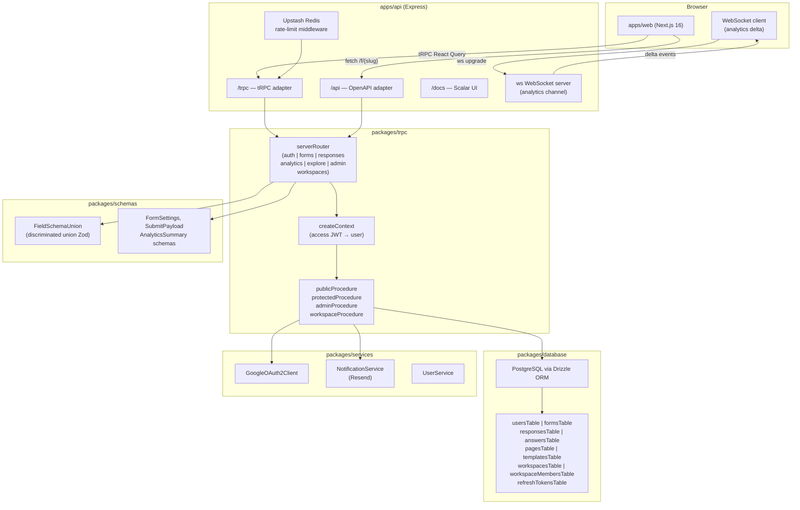
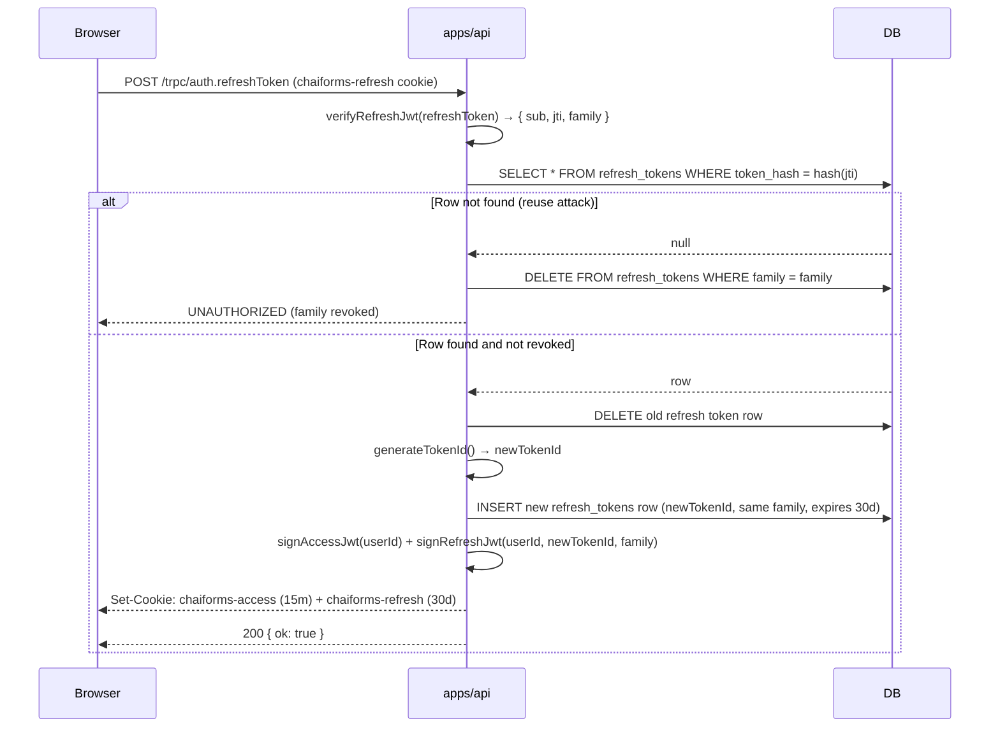
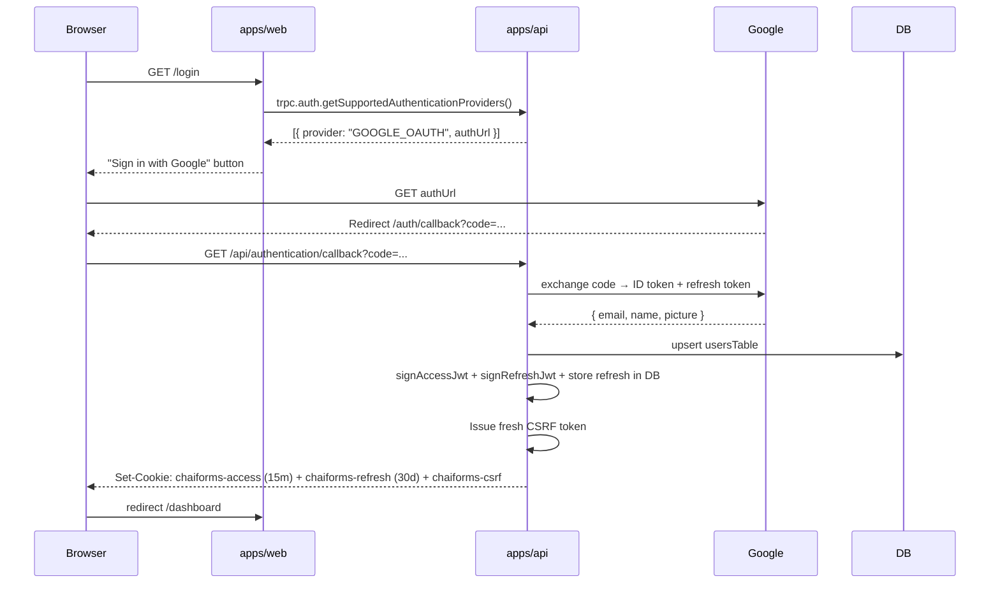
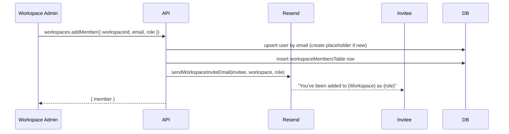
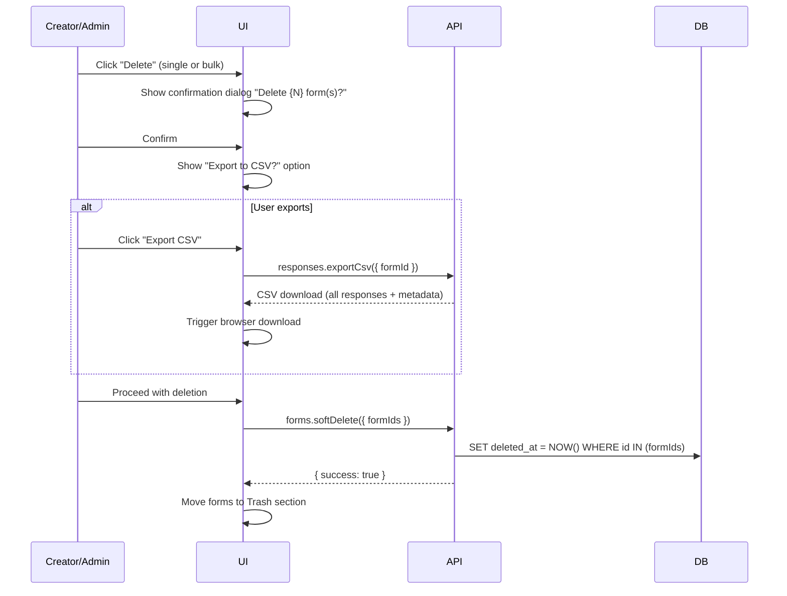

# Design Document: ChaiForms — Form Builder SaaS

## Overview

ChaiForms is a Typeform-style form builder SaaS layered on top of the existing Turborepo monorepo. Authenticated creators build, publish, and analyze forms; unauthenticated respondents fill and submit them via shareable links. The system reuses the existing Express + tRPC v11 backend, Next.js 16 frontend, Drizzle ORM + PostgreSQL data layer, Neon Auth + Google OAuth infrastructure, extending each with new tables, procedures, and UI surfaces.

### Key Design Goals

- **Type safety end-to-end**: shared Zod schemas in `packages/schemas` flow from DB → tRPC → React without duplication.
- **Schema-less field evolution**: form fields stored as JSONB on `formsTable`; answers normalized to `answersTable` rows for analytics.
- **Controlled submission access**: forms may be anonymous or authenticated, workspace-scoped or global — independently configurable.
- **Discriminated-union field schemas**: `FieldSchemaUnion` ensures compile-time exhaustiveness and runtime validation.
- **Fire-and-forget email**: notifications never block the response persist path.
- **Real-time analytics**: WebSocket delta streaming keeps analytics dashboards live without polling.
- **Workspace collaboration**: workspaces group creators and viewers with per-workspace roles, email-invited membership.
- **Defense-in-depth auth**: short-lived JWTs with rotating refresh tokens, HMAC-signed CSRF double-submit cookies, and Upstash Redis rate limiting on all route groups.

---

## Architecture

### Component Diagram



### Request Flow — Protected Procedure

```
Browser → POST /trpc/forms.create
  → Upstash rate limit (mutations: 60/min per IP)
  → tRPC adapter → createContext()
      → reads "chaiforms-access" httpOnly cookie
      → verifies short-lived access JWT (jsonwebtoken, 15 min)
      → queries usersTable by id
      → checks isBlocked → throws FORBIDDEN if blocked
      → attaches { user } to ctx
  → protectedProcedure middleware
      → throws UNAUTHORIZED if ctx.user is null
  → forms.create handler
      → validates input with Zod
      → inserts formsTable row
      → returns form
```

### Request Flow — Token Refresh

```
Browser → POST /trpc/auth.refreshToken
  → reads "chaiforms-refresh" httpOnly cookie (30-day refresh token)
  → verifyJwt(refreshToken) → { sub: userId, tokenFamily }
  → looks up refreshTokensTable row by tokenId + userId
  → if row NOT found (reuse attack) → revoke entire family → UNAUTHORIZED
  → if found → rotate: delete old row, insert new refresh token row
  → signAccessJwt(userId) → set new "chaiforms-access" cookie (15 min)
  → signRefreshJwt(userId, newTokenId, family) → set new "chaiforms-refresh" cookie (30 days)
  → return { ok: true }
```

### Request Flow — Public Form Submit

```
Browser → POST /trpc/responses.submit
  → Upstash rate limit (10 req / 60s per IP)
  → tRPC adapter → createContext() (no auth required for anonymous forms)
  → publicProcedure
  → responses.submit handler
      → load form + fields from formsTable
      → check requiresAuth: if true and ctx.user is null → UNAUTHORIZED
      → if form.workspaceId set and requiresAuth → verify ctx.user is workspace member
      → check status, expiry, responseLimit, password token
      → validate answers against FieldSchemaUnion
      → insert responsesTable row (startedAt from payload, submittedAt = now)
      → bulk insert answersTable rows
      → broadcast delta to WebSocket analytics channel
      → fire-and-forget: NotificationService.sendSubmissionEmails()
      → return { success: true, responseId }
```

### WebSocket Analytics Delta

```
Browser → GET /ws?channel=analytics:{formId}&token={csrfToken}
  → HTTP Upgrade to WebSocket
  → server verifies access JWT cookie + CSRF token in query param
  → subscribes client to form's analytics channel
  → on responses.submit success: broadcast { type: "response_delta", formId, delta }
  → client merges delta into local analytics state (no full page reload)
```

---

## Data Models

### Drizzle Schema — `packages/database/models/`

#### Extended `usersTable` (`models/user.ts`)

```typescript
import { pgTable, uuid, varchar, timestamp, boolean, text, pgEnum } from "drizzle-orm/pg-core";

export const userRoleEnum = pgEnum("user_role", ["creator", "admin"]);

export const usersTable = pgTable("users", {
  id: uuid("id").primaryKey().defaultRandom(),
  fullName: varchar("full_name", { length: 80 }).notNull(),
  email: varchar("email", { length: 255 }).notNull().unique(),
  emailVerified: boolean("email_verified").default(false),
  profileImageUrl: text("profile_image_url"),
  neonAuthUserId: text("neon_auth_user_id").unique(),
  role: userRoleEnum("role").default("creator").notNull(),
  /** Blocked users receive FORBIDDEN on all protected procedures */
  isBlocked: boolean("is_blocked").default(false).notNull(),
  createdAt: timestamp("created_at").defaultNow(),
  updatedAt: timestamp("updated_at").$onUpdate(() => new Date()),
});
```

#### `refreshTokensTable` (`models/refresh-token.ts`)

```typescript
import { pgTable, uuid, text, timestamp, boolean, index } from "drizzle-orm/pg-core";
import { usersTable } from "./user";

export const refreshTokensTable = pgTable("refresh_tokens", {
  id: uuid("id").primaryKey().defaultRandom(),
  userId: uuid("user_id").notNull().references(() => usersTable.id, { onDelete: "cascade" }),
  /** Hashed token value — never store plaintext */
  tokenHash: text("token_hash").notNull().unique(),
  /** Token family for reuse-attack detection — revoke all on reuse */
  family: uuid("family").notNull(),
  expiresAt: timestamp("expires_at").notNull(),
  revokedAt: timestamp("revoked_at"),
  createdAt: timestamp("created_at").defaultNow(),
}, (t) => [
  index("refresh_tokens_user_id_idx").on(t.userId),
  index("refresh_tokens_family_idx").on(t.family),
]);

export type SelectRefreshToken = typeof refreshTokensTable.$inferSelect;
export type InsertRefreshToken = typeof refreshTokensTable.$inferInsert;
```

#### `workspacesTable` (`models/workspace.ts`)

```typescript
import { pgTable, uuid, varchar, text, timestamp, index } from "drizzle-orm/pg-core";
import { usersTable } from "./user";

export const workspacesTable = pgTable("workspaces", {
  id: uuid("id").primaryKey().defaultRandom(),
  name: varchar("name", { length: 100 }).notNull(),
  description: text("description"),
  ownerId: uuid("owner_id").notNull().references(() => usersTable.id, { onDelete: "cascade" }),
  createdAt: timestamp("created_at").defaultNow(),
  updatedAt: timestamp("updated_at").$onUpdate(() => new Date()),
}, (t) => [
  index("workspaces_owner_id_idx").on(t.ownerId),
]);

export type SelectWorkspace = typeof workspacesTable.$inferSelect;
export type InsertWorkspace = typeof workspacesTable.$inferInsert;
```

#### `workspaceMembersTable` (`models/workspace-member.ts`)

```typescript
import { pgTable, uuid, pgEnum, timestamp, uniqueIndex, index } from "drizzle-orm/pg-core";
import { workspacesTable } from "./workspace";
import { usersTable } from "./user";

/**
 * Workspace-level roles are independent of global user roles.
 * - admin:   can add/remove members, manage all forms in workspace
 * - creator: can create and manage their own forms inside workspace
 * - viewer:  read-only access to workspace forms and their responses/analytics
 */
export const workspaceRoleEnum = pgEnum("workspace_role", ["admin", "creator", "viewer"]);

export const workspaceMembersTable = pgTable("workspace_members", {
  id: uuid("id").primaryKey().defaultRandom(),
  workspaceId: uuid("workspace_id").notNull().references(() => workspacesTable.id, { onDelete: "cascade" }),
  userId: uuid("user_id").notNull().references(() => usersTable.id, { onDelete: "cascade" }),
  role: workspaceRoleEnum("role").notNull(),
  invitedAt: timestamp("invited_at").defaultNow(),
  acceptedAt: timestamp("accepted_at"),
}, (t) => [
  uniqueIndex("workspace_members_unique").on(t.workspaceId, t.userId),
  index("workspace_members_workspace_id_idx").on(t.workspaceId),
  index("workspace_members_user_id_idx").on(t.userId),
]);

export type SelectWorkspaceMember = typeof workspaceMembersTable.$inferSelect;
export type InsertWorkspaceMember = typeof workspaceMembersTable.$inferInsert;
```

#### Extended `formsTable` (`models/form.ts`)

```typescript
import {
  pgTable, uuid, varchar, text, timestamp, jsonb, integer, pgEnum,
  boolean, index, uniqueIndex,
} from "drizzle-orm/pg-core";
import { usersTable } from "./user";
import { workspacesTable } from "./workspace";
import type { FieldSchemaUnion } from "@repo/schemas";

export const formStatusEnum = pgEnum("form_status", ["draft", "published", "archived"]);
export const formVisibilityEnum = pgEnum("form_visibility", ["public", "unlisted"]);
export const formScopeEnum = pgEnum("form_scope", ["global", "workspace"]);
export const formThemeEnum = pgEnum("form_theme", [
  "default", "anime", "movie", "game", "startup", "tech_company", "os", "event",
]);

export const formsTable = pgTable("forms", {
  id: uuid("id").primaryKey().defaultRandom(),
  creatorId: uuid("creator_id").notNull().references(() => usersTable.id, { onDelete: "cascade" }),

  /**
   * workspaceId: if set, form is workspace-scoped (visible only to members).
   * If null, form is global (visible on Explore when public+published).
   */
  workspaceId: uuid("workspace_id").references(() => workspacesTable.id, { onDelete: "set null" }),

  /**
   * scope mirrors workspaceId but is an explicit enum for query clarity.
   * "global" = discoverable via Explore (if public+published); "workspace" = workspace-only.
   */
  scope: formScopeEnum("scope").default("global").notNull(),

  /**
   * requiresAuth: if true, respondents must be logged in to submit.
   * For workspace-scoped + requiresAuth: respondent must be a workspace member.
   * For global + requiresAuth: any logged-in ChaiForms user may submit.
   * For anonymous (requiresAuth=false): anyone with the link may submit.
   */
  requiresAuth: boolean("requires_auth").default(false).notNull(),

  title: varchar("title", { length: 255 }).notNull(),
  description: text("description"),
  slug: varchar("slug", { length: 60 }).notNull(),
  status: formStatusEnum("status").default("draft").notNull(),
  visibility: formVisibilityEnum("visibility").default("unlisted").notNull(),
  theme: formThemeEnum("theme").default("default").notNull(),
  fields: jsonb("fields").$type<FieldSchemaUnion[]>().default([]).notNull(),
  thankyouMessage: text("thankyou_message"),
  expiryDate: timestamp("expiry_date"),
  responseLimit: integer("response_limit"),
  accessPasswordHash: text("access_password_hash"),
  sendRespondentConfirmation: boolean("send_respondent_confirmation").default(false).notNull(),

  /** Soft-delete: set on "delete", cleared on "recover". Purged after 7 days by cron. */
  deletedAt: timestamp("deleted_at"),

  createdAt: timestamp("created_at").defaultNow(),
  updatedAt: timestamp("updated_at").$onUpdate(() => new Date()),
}, (t) => [
  uniqueIndex("forms_slug_unique").on(t.slug),
  index("forms_creator_id_idx").on(t.creatorId),
  index("forms_workspace_id_idx").on(t.workspaceId),
  index("forms_status_visibility_idx").on(t.status, t.visibility),
  index("forms_deleted_at_idx").on(t.deletedAt),
]);

export type SelectForm = typeof formsTable.$inferSelect;
export type InsertForm = typeof formsTable.$inferInsert;
```

#### `pagesTable`, `responsesTable`, `answersTable`, `templatesTable`

These are unchanged from the original design. See individual model files.

---

## Auth Flow

### Token Architecture

| Token | Name | Storage | Expiry | Purpose |
|---|---|---|---|---|
| Access JWT | `chaiforms-access` | httpOnly cookie | **15 minutes** | Authenticate API requests |
| Refresh JWT | `chaiforms-refresh` | httpOnly cookie | **30 days** | Issue new access tokens |
| CSRF token | `chaiforms-csrf` | JS-readable cookie + `x-csrf-token` header | 24 hours | Double-submit CSRF protection |
| Unlock token | request body | `sessionStorage` | 1 hour | Password-protected form unlock |

### JWT Utilities (`packages/trpc/server/utils/jwt.ts`)

```typescript
import jwt from "jsonwebtoken";
import { createHash, randomBytes } from "node:crypto";

const ACCESS_EXPIRY = "15m";
const REFRESH_EXPIRY = "30d";

export function signAccessJwt(userId: string): string {
  return jwt.sign({ sub: userId, type: "access" }, getJwtSecret(), { expiresIn: ACCESS_EXPIRY });
}

export function signRefreshJwt(userId: string, tokenId: string, family: string): string {
  return jwt.sign(
    { sub: userId, jti: tokenId, family, type: "refresh" },
    getJwtSecret(),
    { expiresIn: REFRESH_EXPIRY }
  );
}

export function verifyAccessJwt(token: string): { sub: string } {
  const payload = jwt.verify(token, getJwtSecret()) as { sub: string; type: string };
  if (payload.type !== "access") throw new Error("Not an access token");
  return { sub: payload.sub };
}

export function verifyRefreshJwt(token: string): { sub: string; jti: string; family: string } {
  const payload = jwt.verify(token, getJwtSecret()) as {
    sub: string; jti: string; family: string; type: string;
  };
  if (payload.type !== "refresh") throw new Error("Not a refresh token");
  return { sub: payload.sub, jti: payload.jti, family: payload.family };
}

export function hashToken(raw: string): string {
  return createHash("sha256").update(raw).digest("hex");
}

export function generateTokenId(): string {
  return randomBytes(32).toString("hex");
}
```

### Cookie Options

```typescript
export function accessCookieOptions(isProd: boolean) {
  return {
    httpOnly: true,
    sameSite: "lax" as const,
    secure: isProd,
    maxAge: 15 * 60 * 1000,       // 15 minutes in ms
    path: "/",
  };
}

export function refreshCookieOptions(isProd: boolean) {
  return {
    httpOnly: true,
    sameSite: "lax" as const,
    secure: isProd,
    maxAge: 30 * 24 * 60 * 60 * 1000, // 30 days in ms
    path: "/trpc/auth",           // narrow path to reduce attack surface
  };
}
```

### `createContext` — Dual Cookie Auth

```typescript
// packages/trpc/server/context.ts
export async function createContext({ req, res }: CreateExpressContextOptions) {
  let user: SelectUser | null = null;

  // 1. Try access JWT (primary path)
  const accessCookie = req.cookies?.["chaiforms-access"];
  if (accessCookie) {
    try {
      const { sub } = verifyAccessJwt(accessCookie);
      const [found] = await db.select().from(usersTable).where(eq(usersTable.id, sub)).limit(1);
      if (found && !found.isBlocked) user = found;
    } catch { /* expired or invalid */ }
  }

  // 2. Fallback: Neon Auth session (Better Auth cookie)
  if (!user) {
    const sessionToken = extractNeonSessionToken({ headers: req.headers, cookies: req.cookies });
    if (sessionToken) {
      try {
        const profile = await getNeonAuthProfileBySessionToken(sessionToken);
        if (profile) user = await syncUserFromNeonAuth(profile);
        if (user?.isBlocked) user = null;
      } catch { user = null; }
    }
  }

  // 3. Fallback: legacy demo session cookie
  if (!user) {
    const demoCookie = req.cookies?.["chaiforms-demo-session"];
    if (demoCookie) {
      try {
        const { sub } = verifyAccessJwt(demoCookie);
        const [found] = await db.select().from(usersTable).where(eq(usersTable.id, sub)).limit(1);
        if (found && !found.isBlocked) user = found;
      } catch { user = null; }
    }
  }

  return { user, req, res };
}
```

### Token Refresh Sequence



### Google OAuth Callback Sequence



### `protectedProcedure` Middleware

```typescript
export const protectedProcedure = publicProcedure.use(({ ctx, next }) => {
  if (!ctx.user) throw new TRPCError({ code: "UNAUTHORIZED" });
  return next({ ctx: { ...ctx, user: ctx.user } });
});

export const adminProcedure = protectedProcedure.use(({ ctx, next }) => {
  if (ctx.user.role !== "admin") throw new TRPCError({ code: "FORBIDDEN" });
  return next({ ctx });
});
```

---

## CSRF Protection

### Strategy: HMAC-Signed Double-Submit Cookie (Hardened)

The existing CSRF double-submit pattern is retained and hardened:

1. **CSRF token**: `GET /csrf` issues a signed token: `{raw}.{HMAC-SHA256(raw, CSRF_SECRET)}`. Stored in a JS-readable cookie (`chaiforms-csrf`, `SameSite=Strict`, **not** httpOnly so JS can read it).
2. **Every mutation**: client reads the cookie and sends it in `x-csrf-token` header.
3. **`assertCsrf()`**: validates signature, cookie-header equality, and Origin/Referer against `WEB_ORIGIN`.
4. **On sign-in**: a fresh CSRF token cookie is always set alongside the access+refresh cookies.
5. **WebSocket upgrade**: CSRF token passed as `?csrf={token}` query param; server validates before upgrading.

```typescript
// packages/trpc/server/utils/csrf.ts — cookie options (hardened)
export function csrfCookieOptions(isProd: boolean) {
  return {
    httpOnly: false,        // must be JS-readable for header injection
    sameSite: "strict" as const,  // upgraded from "lax" to "strict"
    secure: isProd,
    path: "/",
    maxAge: 60 * 60 * 24, // 24 hours
  };
}
```

---

## Rate Limiting Strategy

### Upstash Redis — All Route Groups

Rate limiting is enforced via Upstash Redis `@upstash/ratelimit` across all tRPC routes, grouped by type:

| Route Group | Window | Max Requests | Identifier |
|---|---|---|---|
| Auth endpoints (`auth.*`) | 60s | 10 | IP |
| Mutations (non-auth) | 60s | 60 | IP |
| Queries | 60s | 200 | IP |
| Form submissions (`responses.submit`) | 60s | 10 | IP + device fingerprint |

```typescript
// packages/trpc/server/utils/rate-limiter.ts
import { Ratelimit } from "@upstash/ratelimit";
import { Redis } from "@upstash/redis";
import { TRPCError } from "@trpc/server";

const redis = new Redis({
  url: process.env.UPSTASH_REDIS_REST_URL!,
  token: process.env.UPSTASH_REDIS_REST_TOKEN!,
});

export const authRatelimit = new Ratelimit({
  redis,
  limiter: Ratelimit.slidingWindow(10, "60 s"),
  prefix: "chaiforms:rate:auth",
});

export const mutationRatelimit = new Ratelimit({
  redis,
  limiter: Ratelimit.slidingWindow(60, "60 s"),
  prefix: "chaiforms:rate:mutation",
});

export const queryRatelimit = new Ratelimit({
  redis,
  limiter: Ratelimit.slidingWindow(200, "60 s"),
  prefix: "chaiforms:rate:query",
});

export const submitRatelimit = new Ratelimit({
  redis,
  limiter: Ratelimit.slidingWindow(10, "60 s"),
  prefix: "chaiforms:responses:submit",
  analytics: true,
});

export async function assertRateLimit(
  limiter: Ratelimit,
  identifier: string
): Promise<void> {
  const { success, reset } = await limiter.limit(identifier);
  if (!success) {
    const retryAfterSeconds = Math.max(1, Math.ceil((reset - Date.now()) / 1000));
    throw new TRPCError({
      code: "TOO_MANY_REQUESTS",
      message: `Rate limit exceeded. Retry after ${retryAfterSeconds} seconds.`,
    });
  }
}
```

The middleware is applied inside `trpc.ts` per procedure type:

```typescript
const rateLimitMiddleware = tRPCContext.middleware(async ({ ctx, next, type }) => {
  const ip = ctx.req.ip ?? "unknown";
  if (type === "mutation") await assertRateLimit(mutationRatelimit, ip);
  if (type === "query") await assertRateLimit(queryRatelimit, ip);
  return next();
});

export const publicProcedure = tRPCContext.procedure
  .use(csrfMiddleware)
  .use(rateLimitMiddleware);
```

Auth procedures use `authRatelimit` directly inside the handler. `responses.submit` uses `submitRatelimit` with IP + device fingerprint as identifier.

Falls back to in-memory buckets when `UPSTASH_REDIS_REST_URL` / `UPSTASH_REDIS_REST_TOKEN` are not set (development only).

---

## Workspace Model

### Role Hierarchy

```
Global roles (usersTable.role):
  admin   → platform-wide admin: can see all workspaces/forms/users
  creator → default: can create forms and workspaces

Workspace roles (workspaceMembersTable.role):
  admin   → within the workspace: add/remove members, manage all forms
  creator → create and manage own forms in workspace; cannot manage members
  viewer  → read-only: view workspace forms, responses, analytics (no creation/editing)
```

Global `admin` role does NOT automatically grant workspace-admin access — they have cross-tenant **read** access via `adminProcedure` only. Workspace admins must explicitly be added.

### Workspace-Scoped Form Access

| Scope | requiresAuth | Who can submit |
|---|---|---|
| `workspace` | `true` | Only workspace members who are logged in |
| `workspace` | `false` | Anyone with the link (anonymous OK) |
| `global` | `true` | Any logged-in ChaiForms user |
| `global` | `false` | Anyone (fully anonymous) |

Workspace-scoped forms with `visibility = public` still appear on the Explore page (they are discoverable), but submissions are gated per the above rules.

### Workspace Invitation Email Flow



---

## Form Archive and Soft-Delete

### Status vs Deletion

| State | How it's set | What it means | Visible in dashboard |
|---|---|---|---|
| `archived` | Creator/Admin clicks "Archive" | Inactive, no submissions, kept long-term | Archive section |
| `deletedAt` set | Creator/Admin clicks "Delete" (after confirm+export prompt) | Soft-deleted, recoverable for 7 days | Trash/Recover section |
| Purged | Cron job after 7 days | Hard-deleted from DB | Gone |

### Delete Confirmation + Export Flow



### CSV Export Schema

Each row = one response. Columns:

| Column | Source |
|---|---|
| `response_id` | `responsesTable.id` |
| `submitted_at` | `responsesTable.submittedAt` |
| `respondent_email` | `responsesTable.respondentEmail` |
| `device_type` | `responsesTable.deviceType` |
| `os_name` | `responsesTable.osName` |
| `browser_name` | `responsesTable.browserName` |
| `geo_country` | `responsesTable.geoCountry` |
| `geo_city` | `responsesTable.geoCity` |
| `{field label}` (one column per field) | `answersTable.value` joined to `formsTable.fields` |

Multi-select answers are stored as JSON arrays in `value`; the CSV cell contains the raw JSON string.

### 7-Day Recovery

```typescript
// packages/trpc/server/routes/forms/route.ts

// Soft delete
forms.softDelete = protectedProcedure
  .input(z.object({ formIds: z.array(z.string().uuid()).min(1) }))
  .mutation(async ({ input, ctx }) => {
    // validate ownership of all formIds...
    await db.update(formsTable)
      .set({ deletedAt: new Date() })
      .where(and(
        inArray(formsTable.id, input.formIds),
        eq(formsTable.creatorId, ctx.user.id)
      ));
    return { success: true };
  });

// Recover
forms.recover = protectedProcedure
  .input(z.object({ formIds: z.array(z.string().uuid()).min(1) }))
  .mutation(async ({ input, ctx }) => {
    await db.update(formsTable)
      .set({ deletedAt: null })
      .where(and(
        inArray(formsTable.id, input.formIds),
        eq(formsTable.creatorId, ctx.user.id),
        isNotNull(formsTable.deletedAt)
      ));
    return { success: true };
  });
```

Purge cron (runs daily via a scheduled job or Cloud Scheduler):

```typescript
// apps/api/src/cron/purge-deleted-forms.ts
const RECOVERY_WINDOW_MS = 7 * 24 * 60 * 60 * 1000;

export async function purgeExpiredForms() {
  const cutoff = new Date(Date.now() - RECOVERY_WINDOW_MS);
  await db.delete(formsTable).where(
    and(isNotNull(formsTable.deletedAt), lte(formsTable.deletedAt, cutoff))
  );
}
```

---

## WebSocket Analytics Architecture

### Server Setup

```typescript
// apps/api/src/websocket.ts
import { WebSocketServer } from "ws";
import type { Server } from "node:http";

const channels = new Map<string, Set<WebSocket>>();

export function setupWebSocketServer(server: Server) {
  const wss = new WebSocketServer({ noServer: true });

  server.on("upgrade", (request, socket, head) => {
    const url = new URL(request.url!, `http://${request.headers.host}`);
    const channel = url.searchParams.get("channel");
    const csrfToken = url.searchParams.get("csrf");

    // Validate CSRF token before upgrading
    try {
      assertCsrf({ headers: request.headers, method: "GET", csrfToken });
    } catch {
      socket.destroy();
      return;
    }

    wss.handleUpgrade(request, socket, head, (ws) => {
      if (!channel) { ws.close(4000, "Missing channel"); return; }
      if (!channels.has(channel)) channels.set(channel, new Set());
      channels.get(channel)!.add(ws);
      ws.on("close", () => channels.get(channel)?.delete(ws));
    });
  });
}

/** Called by responses.submit handler after DB writes */
export function broadcastDelta(formId: string, delta: object) {
  const channel = `analytics:${formId}`;
  const message = JSON.stringify({ type: "response_delta", formId, delta });
  channels.get(channel)?.forEach((ws) => {
    if (ws.readyState === ws.OPEN) ws.send(message);
  });
}
```

### Client Hook

```typescript
// apps/web/hooks/use-analytics-ws.ts
export function useAnalyticsWs(formId: string) {
  const [delta, setDelta] = useState<AnalyticsDelta | null>(null);

  useEffect(() => {
    const csrfCookie = document.cookie.match(/chaiforms-csrf=([^;]+)/)?.[1];
    const ws = new WebSocket(
      `${WS_BASE_URL}/ws?channel=analytics:${formId}&csrf=${csrfCookie}`
    );
    ws.onmessage = (event) => {
      const msg = JSON.parse(event.data);
      if (msg.type === "response_delta") setDelta(msg.delta);
    };
    return () => ws.close();
  }, [formId]);

  return delta;
}
```

---

## tRPC Procedure Additions

### `auth` Router (new procedures)

```typescript
authRouter = router({
  // ... existing: getSupportedAuthenticationProviders, callback, me, signOut, syncSession, demoLogin

  refreshToken: publicProcedure
    .meta({ openapi: { method: "POST", path: "/authentication/refresh", tags: TAGS } })
    .input(zodUndefinedModel)
    .output(z.object({ ok: z.boolean() }))
    .mutation(async ({ ctx }) => {
      // read chaiforms-refresh cookie → verify → rotate → issue new cookies
    }),
});
```

### `workspaces` Router (new)

```typescript
workspacesRouter = router({
  create: protectedProcedure
    .input(z.object({ name: z.string().min(1).max(100), description: z.string().optional() }))
    .output(workspaceOutputSchema)
    .mutation(...),

  list: protectedProcedure
    .output(z.array(workspaceOutputSchema))
    .query(...),  // returns workspaces where user is a member or owner

  getById: protectedProcedure
    .input(z.object({ workspaceId: z.string().uuid() }))
    .output(workspaceOutputSchema)
    .query(...),

  addMember: workspaceAdminProcedure
    .input(z.object({
      workspaceId: z.string().uuid(),
      email: z.string().email(),
      role: z.enum(["admin", "creator", "viewer"]),
    }))
    .output(workspaceMemberOutputSchema)
    .mutation(...),  // upsert user by email, insert member row, send invite email

  removeMember: workspaceAdminProcedure
    .input(z.object({ workspaceId: z.string().uuid(), userId: z.string().uuid() }))
    .output(z.object({ success: z.boolean() }))
    .mutation(...),

  updateMemberRole: workspaceAdminProcedure
    .input(z.object({
      workspaceId: z.string().uuid(),
      userId: z.string().uuid(),
      role: z.enum(["admin", "creator", "viewer"]),
    }))
    .output(workspaceMemberOutputSchema)
    .mutation(...),

  listMembers: protectedProcedure
    .input(z.object({ workspaceId: z.string().uuid() }))
    .output(z.array(workspaceMemberOutputSchema))
    .query(...),  // workspace members/admins can list
});
```

### Extended `forms` Router

```typescript
formsRouter = router({
  // ... existing procedures

  // Publish scoped to workspace or globally
  publish: protectedProcedure
    .input(z.object({
      formId: z.string().uuid(),
      scope: z.enum(["global", "workspace"]).optional(),
      workspaceId: z.string().uuid().optional(),
      requiresAuth: z.boolean().optional(),
    }))
    .output(formOutputSchema)
    .mutation(...),

  // Soft delete (replaces hard delete)
  softDelete: protectedProcedure
    .input(z.object({ formIds: z.array(z.string().uuid()).min(1) }))
    .output(z.object({ success: z.boolean() }))
    .mutation(...),

  // Recover from trash (within 7 days)
  recover: protectedProcedure
    .input(z.object({ formIds: z.array(z.string().uuid()).min(1) }))
    .output(z.object({ success: z.boolean() }))
    .mutation(...),

  // List trash (deleted forms within 7-day window)
  listTrash: protectedProcedure
    .output(z.array(formOutputSchema))
    .query(...),

  // Archive (move to archive section, not deleted)
  archive: protectedProcedure
    .input(z.object({ formId: z.string().uuid() }))
    .output(formOutputSchema)
    .mutation(...),

  // List archived forms
  listArchived: protectedProcedure
    .output(z.array(formOutputSchema))
    .query(...),
});
```

### Extended `admin` Router

```typescript
adminRouter = router({
  // ... existing: getStats, listForms, listUsers

  blockUser: adminProcedure
    .input(z.object({ userId: z.string().uuid() }))
    .output(z.object({ success: z.boolean() }))
    .mutation(async ({ input }) => {
      await db.update(usersTable).set({ isBlocked: true }).where(eq(usersTable.id, input.userId));
      return { success: true };
    }),

  unblockUser: adminProcedure
    .input(z.object({ userId: z.string().uuid() }))
    .output(z.object({ success: z.boolean() }))
    .mutation(async ({ input }) => {
      await db.update(usersTable).set({ isBlocked: false }).where(eq(usersTable.id, input.userId));
      return { success: true };
    }),
});
```

### Updated `serverRouter`

```typescript
// packages/trpc/server/index.ts
export const serverRouter = router({
  health: healthRouter,
  auth: authRouter,
  forms: formsRouter,
  responses: responsesRouter,
  analytics: analyticsRouter,
  explore: exploreRouter,
  admin: adminRouter,
  workspaces: workspacesRouter,
});
```

---

## Email Notification Architecture

### Events That Trigger Emails (fire-and-forget via Resend)

| Event | Recipients |
|---|---|
| User added to workspace | Invited user (workspace invite email) |
| Form response received | Creator (submission notification) |
| Form response received (when `sendRespondentConfirmation = true`) | Respondent (if email field present) |

All emails use plain HTML templates (no React Email dependency). All sends are wrapped in `.catch(logger.error)` and called without `await`.

### Workspace Invite Email

```typescript
// packages/services/notification/index.ts (addition)
async sendWorkspaceInviteEmail(opts: {
  inviteeEmail: string;
  inviteeName: string;
  workspaceName: string;
  role: "admin" | "creator" | "viewer";
  webBaseUrl: string;
}): Promise<void> {
  void resend.emails.send({
    from: "ChaiForms <notifications@chaiforms.dev>",
    to: opts.inviteeEmail,
    subject: `You've been added to ${opts.workspaceName} on ChaiForms`,
    html: workspaceInviteEmailHtml(opts),
  }).catch((err) => logger.error("Workspace invite email failed", { error: err.message }));
}
```

---

## Frontend Route Structure

```
app/
  layout.tsx                          ← GlobalProviders, font, metadata
  page.tsx                            ← / (landing page)
  globals.css                         ← Tailwind + theme CSS variables

  (marketing)/
    pricing/page.tsx                  ← /pricing
    explore/page.tsx                  ← /explore
    templates/page.tsx                ← /templates

  auth/
    callback/page.tsx                 ← /auth/callback

  login/page.tsx                      ← /login

  f/
    [slug]/
      page.tsx                        ← /f/{slug} (public form submission)
      password/page.tsx               ← /f/{slug}/password (unlock prompt)

  dashboard/
    layout.tsx                        ← auth guard + dashboard shell
    page.tsx                          ← /dashboard (summary)
    forms/
      page.tsx                        ← /dashboard/forms (active forms list)
      archive/page.tsx                ← /dashboard/forms/archive (archived forms)
      trash/page.tsx                  ← /dashboard/forms/trash (deleted, recoverable)
      new/page.tsx                    ← /dashboard/forms/new
      [formId]/
        edit/page.tsx                 ← /dashboard/forms/{formId}/edit (builder)
        analytics/page.tsx            ← /dashboard/forms/{formId}/analytics
        preview/page.tsx              ← /dashboard/forms/{formId}/preview
        responses/page.tsx            ← /dashboard/forms/{formId}/responses
    workspaces/
      page.tsx                        ← /dashboard/workspaces (list)
      [workspaceId]/
        page.tsx                      ← /dashboard/workspaces/{id} (members + forms)
        forms/page.tsx                ← /dashboard/workspaces/{id}/forms

  admin/
    layout.tsx                        ← admin role guard
    page.tsx                          ← /admin (stats + tables)
    forms/page.tsx                    ← /admin/forms
    users/page.tsx                    ← /admin/users

middleware.ts                         ← redirects /dashboard/* → /login if no session cookie
                                         redirects /admin/* → /dashboard if not admin
```

---

## Form Builder UI Architecture

### Three-Panel Layout

```
┌─────────────────────────────────────────────────────────────────────────┐
│  Header: Form title (editable) │ Saving… / Saved │ Preview │ Publish ▾  │
├──────────────┬──────────────────────────────────┬─────────────────────┤
│  Left Panel  │      Center Canvas               │   Right Panel       │
│  (240px)     │      (flex-1)                    │   (320px)           │
│              │                                  │                     │
│  Field Types │  ┌──────────────────────────┐   │  Field Config       │
│  ─────────── │  │  Scope: Global / WS ▾    │   │  ─────────────      │
│  Short Text  │  │  Requires Auth: [toggle] │   │  Label              │
│  Long Text   │  │  ─────────────────────── │   │  Required toggle    │
│  Email       │  │  [Page 1]                │   │  Placeholder        │
│  Number      │  │  ┌────────────────────┐  │   │  Description        │
│  Single Sel  │  │  │ Field Card 1       │  │   │  Type-specific      │
│  Multi Sel   │  │  └────────────────────┘  │   │  options            │
│  Checkbox    │  │  + Add Field             │   │  Conditional Rules  │
│  Rating      │  └──────────────────────────┘   │                     │
│  Date        │                                  │                     │
└──────────────┴──────────────────────────────────┴─────────────────────┘
```

---

## Analytics Computation Approach

Analytics are computed at query time using SQL aggregations. WebSocket deltas push incremental updates to connected clients (adding the latest response data to the current view without a full refetch).

### Delta Payload

```typescript
type AnalyticsDelta = {
  type: "response_delta";
  formId: string;
  delta: {
    totalResponses: number;          // +1 each submission
    newAnswer: { fieldId: string; value: string }[];
    submittedAt: string;
    durationSeconds: number;
  };
};
```

---

## Error Handling

### tRPC Error Mapping

| Condition | tRPC Error Code | HTTP Status |
|---|---|---|
| No/invalid access token | `UNAUTHORIZED` | 401 |
| Blocked user | `FORBIDDEN` | 403 |
| User is not form owner | `FORBIDDEN` | 403 |
| Non-workspace-member on workspace form | `FORBIDDEN` | 403 |
| Non-admin accessing admin procedure | `FORBIDDEN` | 403 |
| Form not found by ID or slug | `NOT_FOUND` | 404 |
| Invalid Zod input | `BAD_REQUEST` | 400 |
| Slug already taken | `CONFLICT` | 409 |
| Form expired or at response limit | `FORBIDDEN` | 403 |
| Password-protected form, no token | `FORBIDDEN` | 403 |
| Rate limit exceeded | `TOO_MANY_REQUESTS` | 429 |
| Refresh token reuse detected | `UNAUTHORIZED` | 401 |

---

## Correctness Properties

### Existing properties (1–21) — unchanged.

### Property 22: Refresh token rotation correctness

*For any* valid refresh token issued to user U, calling `auth.refreshToken` SHALL issue a new access token and a new refresh token, and revoke the old refresh token. Reusing the old (revoked) refresh token SHALL revoke the entire token family and return `UNAUTHORIZED`.

**Validates: Requirement 1-RT (Refresh Token Mechanism)**

### Property 23: Blocked user gets FORBIDDEN on all protected procedures

*For any* user with `isBlocked = true`, any call to a `protectedProcedure` with a valid access JWT for that user SHALL return `FORBIDDEN` and SHALL NOT execute the handler body.

**Validates: Requirement 24-BLOCK (User Blocking)**

### Property 24: Workspace-scoped + requiresAuth submission enforcement

*For any* workspace-scoped form with `requiresAuth = true`, calling `responses.submit` without a valid access token SHALL return `UNAUTHORIZED`. Calling it with an access token for a user who is NOT a member of the form's workspace SHALL return `FORBIDDEN`. Only workspace members who are authenticated may submit.

**Validates: Requirement WS-ACCESS**

### Property 25: Soft-delete recovery window

*For any* form with `deletedAt` set within the last 7 days, calling `forms.recover` SHALL clear `deletedAt`. For any form with `deletedAt` older than 7 days (purged by cron), it SHALL no longer exist in the DB.

**Validates: Requirement TRASH-RECOVERY**

---

## Key Implementation Decisions and Tradeoffs

### 1–10: Unchanged from original design.

### 11. Short-lived access JWT + refresh token in Postgres

**Decision**: 15-minute access JWT + 30-day refresh token stored hashed in `refreshTokensTable` with token family tracking.

**Rationale**: Short-lived access tokens limit the blast radius of a leaked token (max 15 min exposure). Refresh tokens in Postgres enable server-side revocation (blocking a user immediately revokes all their refresh tokens via cascade delete or `isBlocked` check). Token family tracking detects refresh token reuse attacks (signs of token theft) and revokes the entire family.

**Tradeoff**: Every access token expiry triggers a refresh round-trip (transparent to the user via a client-side interceptor). Slight increase in DB writes for refresh rotations.

### 12. Upstash Redis for all rate limiting groups

**Decision**: Replace in-memory `express-rate-limit` with Upstash Redis `@upstash/ratelimit` for all route groups.

**Rationale**: In-memory limits don't survive pod restarts and don't work across multiple API instances. Upstash's serverless Redis works with the existing Upstash account already used for form submissions. Tiered limits (auth=10, mutations=60, queries=200) prevent both brute-force attacks and API abuse without hampering normal usage.

### 13. Workspace roles are independent of global roles

**Decision**: `workspaceMembersTable.role` (`admin`/`creator`/`viewer`) is decoupled from `usersTable.role` (`admin`/`creator`).

**Rationale**: A global creator might be a viewer in one workspace and a creator in another. A global admin has platform oversight but shouldn't automatically control every workspace's membership. This separation keeps permissions auditable and predictable.

### 14. Soft-delete with 7-day recovery window

**Decision**: Forms are soft-deleted by setting `deletedAt`; a daily cron purges records older than 7 days.

**Rationale**: Accidental deletions are the most common support request in form-builder SaaS. A 7-day window gives creators a safety net without indefinite storage growth. The `archived` status is separate and permanent — it's for intentionally retired forms that should be kept.

### 15. WebSocket delta push for analytics

**Decision**: Use the `ws` library on the same HTTP server via `server.on("upgrade")` rather than a separate WebSocket service.

**Rationale**: Single-process deployment keeps ops simple for the hackathon. Delta events (not full snapshots) keep payload small. CSRF token validation on upgrade prevents cross-site WebSocket hijacking. For multi-instance production, swap to a Redis pub/sub fan-out.

### 16. CSRF cookie upgraded to SameSite=Strict

**Decision**: Change CSRF cookie from `SameSite=Lax` to `SameSite=Strict`.

**Rationale**: The CSRF cookie is explicitly NOT used for session (that's the `chaiforms-access` cookie). Since it only needs to be sent on same-origin requests (which is where the JS reads and attaches it to the header), `Strict` provides stronger protection with no UX cost.
